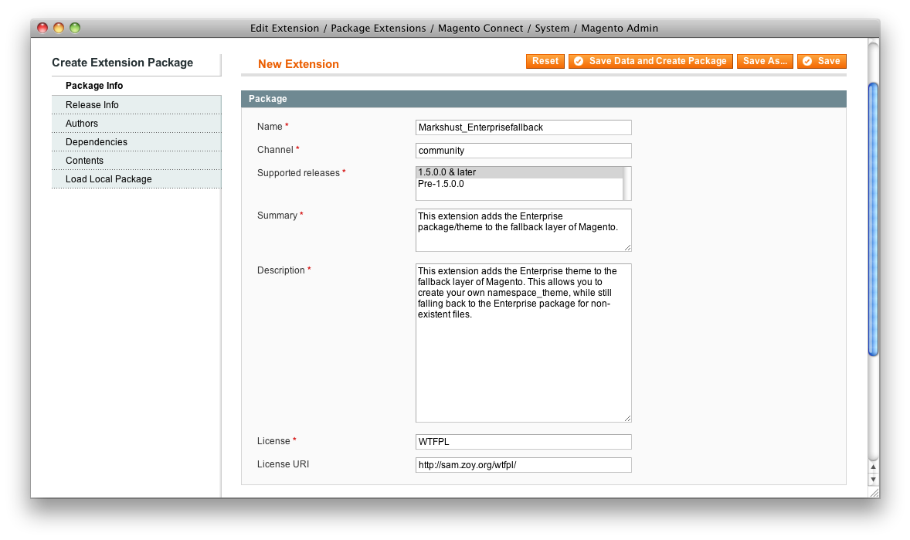
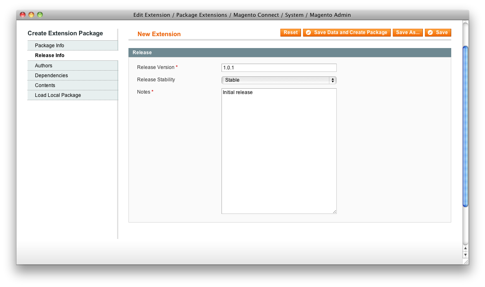
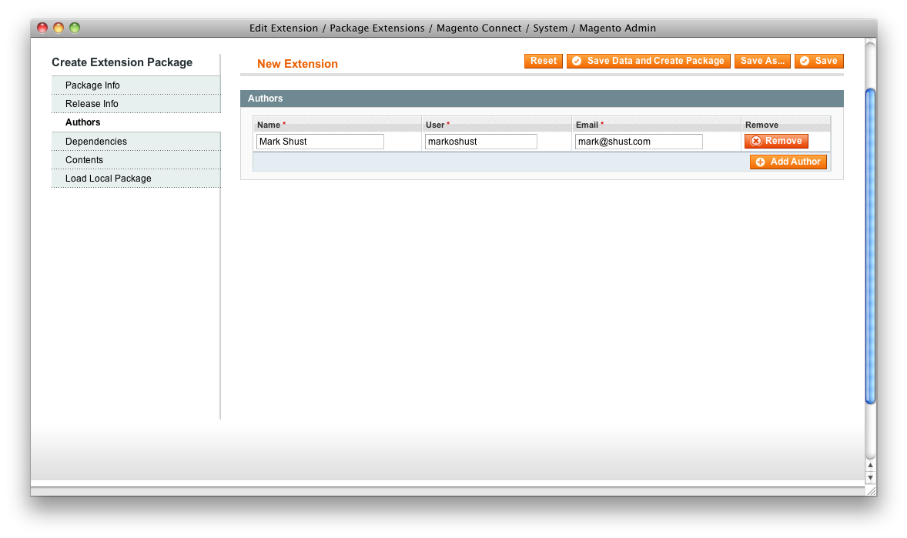
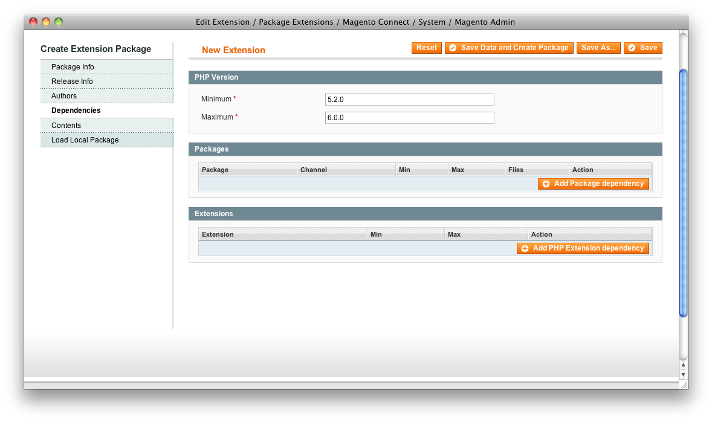
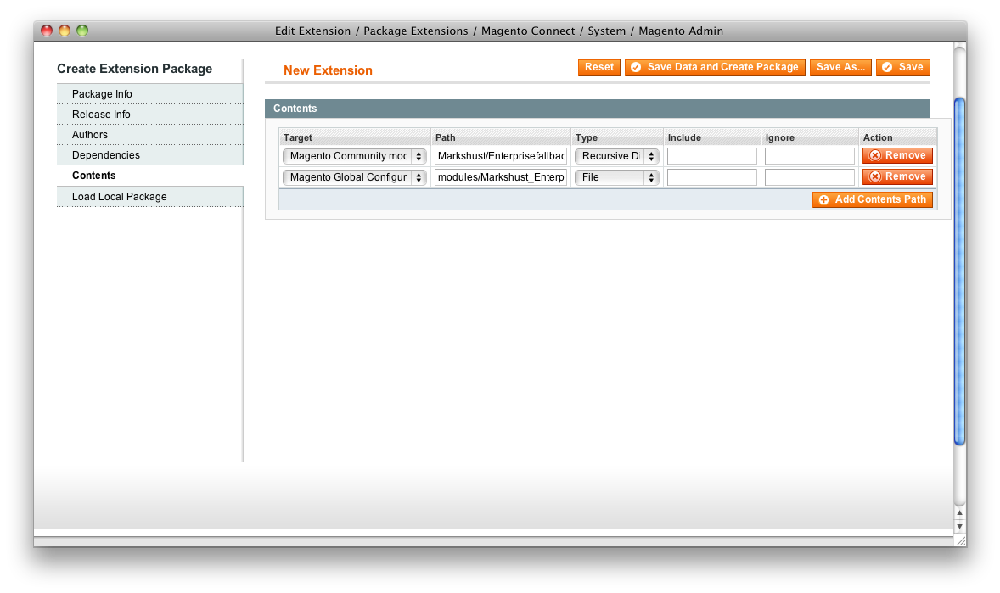
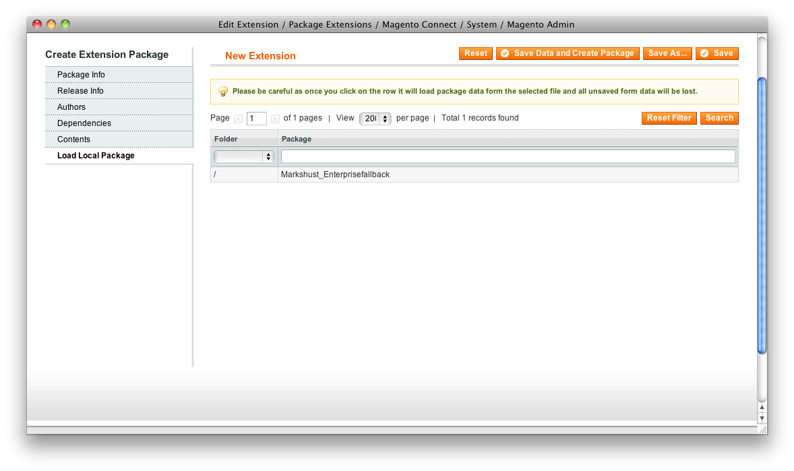

While packaging a Magento extension is very easy, the <a href="http://www.magentocommerce.com/wiki/7_-_magento_connect/packaging_a_magento_extension_in_1.5" target="_blank">1.5 documentation</a> is an epic failure. It is very poorly written, and doesn't show you exactly what to do, what the dropdowns actually mean, or even what to do after you package the extension. There are <a href="http://www.magentocommerce.com/wiki/7_-_magento_connect/creating_magento_connect_extension_package" target="_blank">other documentation pages</a>, but they are bloated and confusing. Hopefully I can clear up some of the confusion that is out there and write up some better documentation.

I will show you an example of packaging my <a href="http://www.magentocommerce.com/magento-connect/enterprise-fallback-7091.html" target="_blank">Enterprise Fallback</a> module. First, go to System &gt; Magento Connect &gt; Package Extensions.

## Package Info

- **Name:** Namespace_Module
- **Channel:** community
- **Supported releases:** 1.5.0.0 &amp; later (Pre-1.5.0.0 is deprecated
- **Summary:** Short description of extension
- **Description:** Longer description of extension
- **License:** Name of License
- **License URI:** Link to License Web URI

## Release Info

- **Release Version:** 1.0.0 (or other version number)
- **Release Stability:** Stable (unless otherwise specified)
- **Notes:** Notes of released version

## Authors

- **Name:** First &amp; Last Name
- **User:** Your Username from Magento Connect
- **Email:** email@address.com

## Dependencies

- **PHP:** Set Minimum to 5.2.0, and Maximum to 6.0.0
- **Packages:** Usually not needed, but add if necessary
- **Extensions:** Usually not needed, but add if necessary

## Contents

- **Target**
- **Magento Local module file:** app/code/local
- **Magento Community module file:** app/code/community
- **Magento Core team module file:** app/code/core
- **Magento User Interface (layouts, templates):** app/design
- **Magento Global Configuration:** app/etc
- **Magento PHP Library file:** lib
- **Magento Locale language file:** app/locale
- **Magento Media library:** media
- **Magento Theme Skin (Images, CSS, JS):** skin
- **Magento Other web accessible file:** /
- **Magento PHPUnit test:** tests
- **Magento other:** /
- **Path:** Enter path relative to above directory with no preceding slash
  - If Magento Community module, set to Namespace/Module
  - If Magento Global Configuration, set to modules/Namespace_Module.xml
- **Type**
  - If Magento Community module, set to Recursive Dir
  - If Magento Global Configuration, set to File
- **Include:** Usually not needed (needs to be regular expression if used)
- **Ignore:** Usually not needed (needs to be regular expression if used)

## Load Local Package

This section loads a package that has been previously saved/created with this process.

## Resulting Package File

Your resulting package is saved as a tgz file in the `var/connect` folder.

Hopefully this clears up some confusion for you!
