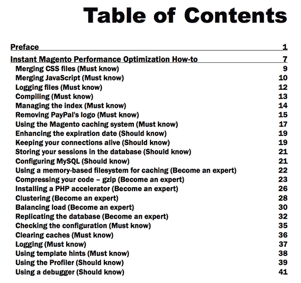

A few weeks ago, I was contacted by Packt Publishing to write a review on a new performance eBook that was available titled <a href="http://www.packtpub.com/magento-performance-optimization-how-to/book" target="_blank">**Instant Magento Performance Optimization How-To** written by Nayrolles Mathieu</a>. Since I always love to play devil's advocate and try my best to criticize everything (my guilty pleasure ;), I gladly accepted the challenge.

## About the Author

I haven't heard of Nayrolles, but I read the About the Author page. While he looks extremely bright (mentions that he has written two Master's theses' in Artificial Intelligence and Quality fields) and has an Information Systems Management degree, it fails to mention any computer programming experience (educational or professional), and there is absolutely no mention of Magento in the biography. What tells me that he is qualified to write this book? Am I learning from one of the best Magento guys around? The thoughts presented in this review most likely all stem back to this fact.

## Table of Contents & Preface

I started through the Table of Contents, and I was sort of immediately thrown back at the subject matter:

Removing PayPal's logo -- a must know. This is really a page in this book? Storing your sessions in the database -- I'm hoping this is telling you to NOT do this, so giving them the benefit of the doubt here. Compressing your code with gzip - is that really *expert* material? Also, do I see Clustering? Is that mentioned in the same breath as Removing PayPal's Logo?

I'm starting to wonder who this book was created for, so headed over to the Preface. This is mainly just an explanation of what Magento is (I hope I know this if i'm purchasing a book on optimizing it), table of contents, and some basic info. The "Who this book is for" says that this book was made for backend technical console people, however it also says people new to all of this may also read the book, so the book lacks technical focus definition. I'm not really sure how this book is for - is it for my mom and dad to read for thier mom & pop store, or is it for my buddy Zoltar who lives in his basement and uses Vim as his IDE?

## Benchmark Tests

Now glancing through all of the content in this book, all of the performance optimization modifications they suggest are followed by a "Before/After" load time chart which is supposed to provide the reader with a guideline of this modification and what sort of results they can expect after completion as compared to without the modification. There are some glaring questions about this ideaology: What kinds of servers are used? How much memory do they have? What kind of software was used for the benchmarks? They do make mention that it could come from a variety of web-based tools such as Pingdom, Firebug, Google Speed Tracer and PageSpeed, however these are highly unreliable methods of doing published benchmark test reports (all front-end tests), and still don't tell us anything about the actualy computer the site is hosted on, so all of these results must be taken with a grain of salt.

## Lack of Technical Detail

I can't (and don't) want to go into further super detail of every mod page and what is wrong with it, however, there are some general concerns that I have to set out there. All of the "How it works..." sections are supposed to explain what is going on. However, this section just gives a very high level overview of what is going on (for example, the Merging Javascript section explains how it works - that Magento merges JavaScript. Ok...). Maybe this goes back to the technical focus of the book (mom and pop, or Zoltar?), but I personally was looking for an explanation such as "Magento iterates through all of the various XML files, goes through it's inherit logic of processing these nodes and combining them into one giant file, and ...". You know? Something a bit more technical descriptive, especially coming from a guy with a couple technical theses' under his belt.

## Lack of Specificity

I went ahead and really looked at the "Removing PayPal's Logo" section, and it does in fact call PayPal's external servers on each request. However, this section could have been looked at from a very different perspective -- "Reducing frontend HTTP connections". This mod should embellish all superfluous HTTP connections, not just the PayPal logo, because singling out them specifically is a little overzealous. Most Magento sites will also either not have a PayPal logo displayed, and/or they may have many other external HTTP requests going out from their site that can slow everything down (VeriSign, SSL Cert Seals, external JavaScript snippets, etc.).

## Wrong Improvements

Coming back to the "Storing sessions in the database" section, well, this is in fact listed as an optimization modification, but it's interesting to point out that this item does not have a corresponding "Before/After" improvement chart like the other sections have. It could be perhaps because database connections are 'expensive' (cost a lot of memory) and if your site is getting any kind of traffic, the multiple database sessions being created will eat up server memory, to the point of thrashing, and will ultimately crash your server. File-based sessions are much faster and more reliable, but there are many other improvements that can be made in terms of session storage and caching, which leads me to the next big point that I have to make...

## Lack of Known Performance Improvements

There's a much better solution to session storage, and it has to do with a system called Redis... or Memcached... or a NoSQL datastore. The fact that none of these were mentioned boggles my mind, because these are the first go-to mods that someone enhancing a Magento store actually makes.

MySQL - Percona?

Apache - Lightspeed? Nginx?

Images - Sprites? Compression?

Now, these are really basic performance enhancements to make, however, none of these are suggested in this book. I don't want to go into more detail of what could have been presented, but this is just the tip of the iceberg of what could be done to make Magento blazing fast. I was actually expecting this book to encapsulate all of these sorts of items, but it failed to delivery on these. There's also no mentioning that client-side improvements can make your site drastically faster than server-side improvements, and no explanation of some concepts that could help the user understand what is going on, and why, to make their site even fast. Just "do this, and you'll get this" material - sort of like <a href="http://www.packtpub.com/magento-14-development-cookbook/book" target="_blank">the other book put out by Packt Publishing</a> that failed on all levels. Packt really seems out of touch with the Magento world. Now, they have created an <a href="http://www.packtpub.com/magento-beginners-guide/book" target="_blank">awesome beginner's Magento book</a> that I would highly recommend, however, this seems to be the only book put out by Packt that is successful.

## Conclusion

I would highly suggest to not even give this book a chance. It fails to deliver on almost all counts and I wouldn't give it anything more than a 1 out of 5 stars. You're better off googling for forum and blog posts with some specificity on what you are trying to improve, and you will most likely find some better answers that trying to find them in this publication.
