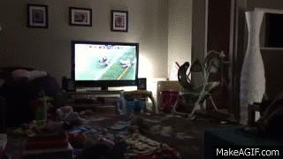

Ever since I watched the World Cup at a BW3, and saw a Budweiser Red Light, I was fascinated with how it worked. When a team scored a goal on TV, the Red Light instantly lit up! Having worked with Firebase and websockets for a bit, I wanted to make that happen.

I did some research and noticed that they used an Electric Imp and an app to control which game they wanted the Red Light to be activated on. So cool.

After I pestered my wife to buy me a tessel for a while, I finally got one for my birthday! I instantly ordered the relay module and went to work. My favorite sport now is NFL football, and I thought how cool it would be to wire up the tessel to a light in my house for my annual Super Bowl party.

I looked around for some streaming NFL score API's, but all of them were a few grand a month. Yah, no. I eventually stumped upon the NFL's basic XML feed and decided to use that. When I synced it up to the tessel, the XML to JSON module was taking roughly 5 seconds to process every call, which was unacceptable (this thing needs to be as real time as I can get! Otherwise what's the purpose...). I finally found a related JSON API, and even though it isn't formatted well and is super basic, it works just great once everything is all dialed in! I basically poll it every second and check the current score against the previously checked score, amongst other logic. And while it's not streaming/websockets, I can poll it every second without the NFL penalizing me and it accomplishes what I was looking for.

Without further adieu, check it out on github at https://github.com/markshust/tessel-nfl!
