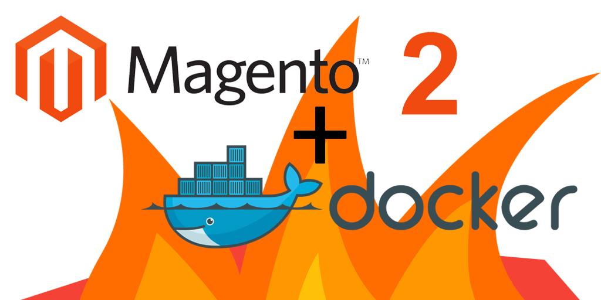

## Why Docker?

Docker has been making it's way all around the world, and containerization is here to stay. PHP development has always been fairly easy to setup on Mac OS X, however with the ever-increasing new releases of PHP (5.4, 5.5, 5.6, 7.x...), you'll eventually come to a point where you'll need to manage multiple projects at the same time, all perhaps running different software versions.

For example, <a href="http://magento.com/resources/system-requirements" target="_blank">Magento 1.x is only supported on PHP 5.4/5.5</a>, and <a href="https://github.com/magento/magento2#step-1-verify-your-prerequisites" target="_blank">Magento 2.x is only supported on PHP 5.5/5.6</a>. While PHP 5.5 may work for both, there are numerous situations where you may not want to do this. Most web hosts are still running PHP 5.3 or 5.4, and you may want to run PHP 5.6 on your Magento 2 install to test out some new features, while still running PHP 5.4 for your Magento 1.x installations. And when PHP 7 is released, it's all downhill from there...

Ideally, you want your dev, staging and production servers to be running the exact same setup in regards to web server, PHP modules, server extensions, and so on. There are so many variables that come into play with running different versions within different environments, and you never want to hear "Well, it runs on my dev. Why doesn't it run on yours?". Even if you are running something like Ubuntu from dev through prod, you'll still have  situations where system packages or software versions don't exactly match each other between environments. And we all love to develop on our Mac ;)

So, Docker to the rescue! <a href="https://www.docker.com/whatisdocker" target="_blank">Docker is a way to run containers</a>. Quoting directly from Docker, Inc.:

> "Docker allows you to package an application with all of its dependencies into a standardized unit for software development."

Perfect. If you want to read more about Docker and it's specifics, you can <a href="http://docs.docker.com/mac/started/" target="_blank">continue to follow some tutorials on Docker</a> to learn more, as this article assumes you know a little bit about it and how it works.

## LAMP on Docker


The thing us PHP devs need is a good LAMP stack, usually with all of the services located on the same physical or virtual machine. However, Docker likes each service to run in it's own container. This is what makes Docker so great: your web server and database server (and even PHP if you run it with php-fpm) can each run isolated within their own container,  but also still all be located on the same bare metal machine or virtualized host. This isolation helps keep all of the different services neat & tidy; working on one container will not affect the settings or functionality of the other containers.

The <a href="https://hub.docker.com/" target="_blank">Docker Hub</a> is a fantastic collection of community-developed containers. This collection will without a doubt help you learn about container setups as well as setup your own. In our case, we chose to start from the `debian:jessie` container, which is sort of like Ubuntu with great APT package management, but more streamlined & compact for server use. This image will contain the Nginx web server as well as PHP. We'll run them using separate containers, as we're using the php-fpm version of PHP.

We'll also be using the `mariadb:10.0` container for MySQL, which is similar to the `mysql:5.6` image, but without being controlled by Oracle (and being more performant). We don't have to do anything with this MariaDB/MySQL image because it's all tested and ready to go. Using official images like these also gives us some assurance that they will be very stable & secure, and supported by the vendor.

## Prerequisites for Mac OS X

Docker will work just fine on a Linux-based operating system such as Ubuntu because it can be ran natively. But OS X is Unix-based, so we'll need to add one additional piece of functionality to be able to run Docker on our Mac.

Our first step is to install Docker, Docker Compose, Vagrant and VirtualBox. I prefer <a href="http://brew.sh/" target="_blank">Homebrew</a> because it's very easy to manage and update packages.

```meta
brew update
brew install docker
brew install docker-compose
brew cask install virtualbox
brew cask install vagrant
```

At Mage Inferno we started off using <a href="http://boot2docker.io/" target="_blank">Boot2Docker</a> for Docker + Mac support, and it generally works ok, but only if you don't plan to mount files from the host system. But this is exactly what we want to do -- mount our local filesystem to the Docker container so we can develop natively on our Mac, just as if it's hosted locally. Boot2Docker uses VirtualBox, which uses the vboxsf filesystem to mount remote files. The problem is that vboxsf is horrifically slow, and the situation is greatly exaggerated when mounting many files (Magento has a few files ;).


No worries! <a href="https://github.com/codekitchen/dinghy" target="_blank">Dinghy</a> to the rescue. This application uses a modified version of Boot2Docker that uses the far superior NFS filesystem to mount remote file shares. It also has some great additions us web developers can really use, including a DNS resolution service and HTTP proxy (which also very neatly runs within it's own container in true Docker fashion). Fairly easy Magento 2 development on Docker and OS X wouldn't be possible without something like Dinghy (at least at the time of this post), so be sure to star the package on github to give the developer some kudos. Let's install Dinghy:

```meta
brew install https://github.com/codekitchen/dinghy/raw/latest/dinghy.rb
```

## Creating Docker Images

A <a href="https://docs.docker.com/reference/builder/" target="_blank">Dockerfile</a> is a list of instructions that will be used to build a docker image. To avoid an even longer tutorial, we went ahead and built out some base Docker images so your don't have to take the time to build them yourself. Think of these images as similar to the pre-built `debian` or `mariadb` images, that you can just plug into and use.

* <a href="https://hub.docker.com/r/mageinferno/magento2-nginx/" class="code" target="_blank">`mageinferno/magento2-nginx`</a>: Simple image that installs Nginx, from `nginx`
* <a href="https://hub.docker.com/r/mageinferno/magento2-php//" class="code" target="_blank">`mageinferno/magento2-php`</a>: Sets up PHP (as php-fpm) & Node requirements for Magento 2, from `php`
* <a href="https://hub.docker.com/r/mageinferno/magento2-setup/" class="code" target="_blank">`mageinferno/magento2-setup`</a>: Script to build & install Magento2, from `mageinferno/magento2-php`

If you would like to know more about each image, please click on the image names above to check out their related Dockerfile and build & setup scripts. We'll use these images to kickoff the installation and server configuration process for our containers, which will help us get Magento 2 up and running without much effort.

> <a href="https://hub.docker.com/u/mageinferno/" target="_blank"><br/>View all Mage Inferno images at Docker Hub</a>

## Running a Docker image

Before we continue any further, now is a good time to see if you can run a Docker image. First, you'll need to start up the Dinghy service if you haven't done so already, which will give you the ability to connect OS X to Docker.

```meta
dinghy up
```

This is the equivalent of running `boot2docker up` or `vagrant up`. You only need to do this once every time you reboot your Mac, and it will keep running in the background until the next time you reboot.

Next, we'll test our setup by starting a `mageinferno/magento2-php` container first.:

```meta
docker run -d --name php-fpm mageinferno/magento2-php
```

This is a very simple command, which runs a container based on the `mageinferno/magento2-php` image, and names it `php-fpm`. The `-d` flag makes it run as a background daemon.

Next, we'll start our web server container:

```meta
docker run -d -e VIRTUAL_HOST=mywebserver.docker --link php-fpm --name mywebserver mageinferno/magento2-nginx
```

The only differences here are the `--link` flag, which will link the `php-fpm` container to this image, and the setting of the `VIRTUAL_HOST` environment variable, which instructs Dinghy to setup the proper DNS and HTTP proxy.

At this point, we should now be able to access our container from the web browser. We can verify the container is running by the command `docker ps`, which lists all running Docker containers.

Open your web browser and visit `http://mywebserver.docker/`

We should now see a "404 Not Found" message from Nginx, which is our success sign that everything is installed correctly and up & running. We don't have to assign ports to our `docker run` command, as the port is already exposed from the Dockerfile, and DNS & port forwarding is taken care of by the wonderful Dinghy HTTP proxy.

We can also access the container via SSH with:

```meta
docker exec -it mywebserver bash
```

We can now explore around the Debian system and do whatever we wish, just as we would a normal web server. Just typing `exit` will take us back to the host machine. The `bash` command above can also be substituted with any other command you'd normally type at a shell prompt, so we can easily run one-off commands.

The container will continue to run until it is stopped:

```meta
docker stop mywebserver
```

If we do `docker ps` now, our container appears to have been removed. However, if we execute `docker ps -a` we can see that this image is still around, but just dormant. We can bring it back to life by running:

```meta
docker start mywebserver
```

And we can delete it, by stopping the server and then executing a remove command:

```meta
docker stop mywebserver
docker rm mywebserver
```

We are getting a 404 error because there are currently no files being served up by Nginx. Let's fix that with a brand new configuration & setup for Magento 2.

## Docker Compose

The final piece of the puzzle is <a href="https://docs.docker.com/compose/" target="_blank">Docker Compose</a>. This allows us to setup a simple YAML configuration file which instructs Docker to run one or more containers based on the images and parameters defined therein.


First, we'll create a new directory in our `~/Sites` folder with the name of our project, and go into it:

```meta
mkdir ~/Sites/mysite
cd ~/Sites/mysite
```

Next, we'll create a file within this directory named `docker-compose.yml` with the following contents:

```yaml
app:
  image: mageinferno/magento2-nginx:1.9
  links:
    - php-fpm
    - db
  volumes_from:
    - appdata
  environment:
    - VIRTUAL_HOST=mysite.docker

appdata:
  image: tianon/true
  volumes:
    - ./src:/src
    - ~/.composer:/root/.composer

"php-fpm":
  image: mageinferno/magento2-php:5.6-fpm
  links:
    - db
  volumes_from:
    - appdata

db:
  image: mariadb:10.0
  ports:
    - "8001:3306"
  volumes_from:
    - dbdata
  environment:
    - MYSQL_ROOT_PASSWORD=magento2
    - MYSQL_DATABASE=magento2
    - MYSQL_USER=magento2
    - MYSQL_PASSWORD=magento2

dbdata:
  image: tianon/true
  volumes:
    - /var/lib/mysql

setup:
  image: mageinferno/magento2-setup:2.0
  links:
    - db
  volumes_from:
    - appdata
  environment:
    - M2SETUP_DB_HOST=db
    - M2SETUP_DB_NAME=magento2
    - M2SETUP_DB_USER=magento2
    - M2SETUP_DB_PASSWORD=magento2
    - M2SETUP_BASE_URL=http://mysite.docker/
    - M2SETUP_ADMIN_FIRSTNAME=Admin
    - M2SETUP_ADMIN_LASTNAME=User
    - M2SETUP_ADMIN_EMAIL=dummy@gmail.com
    - M2SETUP_ADMIN_USER=magento2
    - M2SETUP_ADMIN_PASSWORD=magento2
    - M2SETUP_USE_SAMPLE_DATA=true
```

Note that we can use this same `docker-compose.yml` file in other directories to spawn off another set of Magento 2 containers, and all we have to change are the two references to `mysite.docker`:

- `VIRTUAL_HOST` definition which connects everything through the HTTP proxy
- `M2SETUP_BASE_URL` defines the base URL for our Magento 2 installation

Note the other environment parameters which specify more installation parameters and configuration options, including Magento admin credentials, and whether or not to install the Magento 2 sample data.

During the install, there will be a lot of Composer dependencies installed (unless you've previously downloaded them on your Mac), and we'll almost assuredly hit the GitHub rate limits. Magento now also checks for authentiation info, so you will need to <a href="http://devdocs.magento.com/guides/v2.0/install-gde/prereq/connect-auth.html" target="_blank">request Composer Auth keys</a>. It's best to proactively setup a new GitHub auth token by visiting your <a href="https://github.com/settings/tokens" target="_blank">GitHub Auth Tokens</a>. When creating a token, be sure `public_repo` is checked. We'll store the file on our Mac at `~/.composer/auth.json` in this format:

```js
{
    "http-basic": {
        "repo.magento.com": {
            "username": "PUBLIC_KEY",
            "password": "PRIVATE_KEY"
        }
    },   
    "github-oauth": {
        "github.com": "YOUR_ACCESS_TOKEN_HERE"
    }
}
```

This file will be remotely mounted to our Docker images so GitHub can successfully authenticate and download the Composer packages. If you wait for the prompt and insert the token in the setup script, it will be cloned back to your Mac, because your entire `~/.composer` directory will be remotely mounted from the docker-compose file.

Now we'll run the following command to kickoff the Magento 2 installation:

```meta
docker-compose up setup
```

This will create a container from the `mageinferno/magento2-setup` image, create and mount a folder at `~/Sites/mysite/src` (which will contain all of our Magento 2 source code and project files), create the `db` and `dbdata` images (from the defined `links` reference), and pass in all of those environment variables, which will in turn get passed to the `m2setup.sh` bash file defined within the `mageinferno/magento2-setup` Docker image.

When the `m2setup.sh` bash file is executed, it will start by cloning the Magento 2 git repository from GitHub and installing all of the composer dependencies. Then it will execute the `./bin/magento setup:install` command which will install Magento 2 and setup our database. Then it will finish up by installing the NodeJS dependencies and running the grunt process, which will compile and build all of the necessary frontend scripts. This entire process may take a while (~30-40 minutes depending on if Composer deps are already cached), so go make some coffee and grab a bite to eat.

Once the Magento 2 setup process is all complete, we can create our Apache + PHP Docker container to view our new Magento 2 installation. The `-d` flag tells us to start the containers in the background and keep them running.

```meta
docker-compose up -d app
```

We can now visit our site at `http://mysite.docker` and have fun poking around our new Magento 2 installation.

## Conclusion

We hope this was a good intro into using Docker with Magento 2. The installation process compared to Magento 1 is much more complex, and we hope this will assist you in getting up and running quickly, while also maintaining a good synergy between development, staging and production.

Please note that the images at the time of this writing were intended mainly for development usage, and are not recommended to be run in a production environment. Feel free to modify the Dockerfile accordingly depending on your development needs, and be aware that code, development & deployment strategies will continue to change as the Magento 2 platform becomes more mature.
