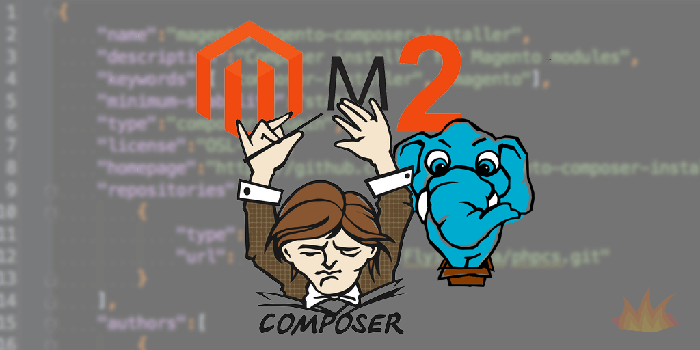

## Introduction



Creating a module for Magento 2 is very different from the "old" way that we are used to in Magento 1. Now that we have Composer at our fingertips, the storage of our module in the VCS is quite a bit cleaner, and we also don't have to worry about code pools since they are by the wayside with M2. This also eliminates the need for third-party code management tools such as modman.

If you don't already have a Magento 2 development environment setup, be sure to check out our blog article on <a href="/2015/07/15/magento-2-development-docker-os-x">Magento 2 Development with Docker on OS X</a> to get started with things quickly & easily.

## composer.json & module.xml

Our first step is to create a new folder for our module:

```meta
mkdir module-foobar
cd module-foobar
```

When storing our module files under version control, we'll only store the root of our module directory and not include `app/code`. First, we will create our `composer.json` file, which will be used for the configuration of our module, with contents as follows:

```javascript
{
    "name": "your-name/module-foobar",
    "description": "Test module for Magento 2",
    "type": "magento2-module",
    "extra": {
        "map": [
            [
                "*",
                "YourName/FooBar"
            ]
        ]
    }
}
```

- `name`: Name of our Composer module, keep it the same name as your git repository for consistency
- `description`: Description of the module
- `type`: This is always magento2-module for modules
- `extra.map`: This maps this repo to the directory YourName/FooBar on a `composer install`

You'll want to change `your-name` to the namespace you are using for your extension that is unique to you or your company. For example, at Mage Inferno, we use the `inferno` namespace.

## Module Definition

We're demonstrating a minimally-viable module here, so all we'll have is the `etc` folder with a module definition file. So, let's create a new file at `etc/module.xml` with the contents:

```xml
<?xml version="1.0"?>
<config xmlns:xsi="http://www.w3.org/2001/XMLSchema-instance" xsi:noNamespaceSchemaLocation="../../../../../lib/internal/Magento/Framework/Module/etc/module.xsd">
    <module name="YourName_FooBar" setup_version="0.0.1" />
</config>
```

There are a few new things here. First, this file is named `module.xml`, not `config.xml`. `module.xml` replaces the file that was previously in M1 at `app/etc/modules/YourName_FooBar.xml`, and `config.xml` is now used for module configuration variables.

Let's break down this file real quick starting with this line:

```meta
xmlns:xsi="http://www.w3.org/2001/XMLSchema-instance" xsi:noNamespaceSchemaLocation="../../../../../lib/internal/Magento/Framework/Module/etc/module.xsd"
```

Here, we are defining the schema that the XML file should follow. You can pretty easily follow what is going on here by opening up `lib/internal/Magento/Framework/Module/etc/module.xsd` and just taking a look around. By browsing through this file, we can see that we should define a `module` element with the required attribute `name`. This is what we are doing at `<module name="YourName_FooBar" />`.

> The `setup_version` property is actually optional, but if you don't define it you will receive an "Attribute Missing" error. <a href="https://github.com/magento/magento2/issues/1493" target="_blank">I've filed a bug with Magento to fix this</a>, so this should work without `setup_version` soon.

## Git Tagging with Packagist


For open source Magento modules, you'll want to go to <a href="https://packagist.org" target="_blank">https://packagist.org</a> and register your namespace & repository for easy installation. Let's first create a repository at either GitHub or Bitbucket, then we will push up our code. We want to use the Git HTTPS URL so Composer can easily download things without an SSH key.

```meta
git init
git add *
git commit -m "Initial commit"
git remote add origin https://github.com/your-name/module-foobar.git
git push -u origin master
git tag 0.0.1-beta
git push --tags
```

Of course you will want to change `your-name` to the name of your GitHub/Bitbucket username. After the code is pushed up, head to <a href="https://packagist.org" target="_blank">https://packagist.org</a>, Register, and Submit your package.

## Downloading Module with Composer


After the package is registered at Packagist, we can easily install our module with Composer by running:

```meta
composer require your-name/module-foobar
```

What this will do is find the Composer package we just registered, look up our GitHub code, download it to `vendor/your-name/module-foobar`, and move it to the location we defined in extra/map: `YourName/FooBar`. We need to tag our release with `0.0.1-beta` so that it gets classified as a `beta` release and gets installed (if we don't, it will be classified as `dev` and won't be approved for our minimum-stability defined in M2's main `composer.json` file).

## Installing Module with Magento Command Line Tool

After Composer does it's stuff, we then have to let Magento know about the module. The `./bin/magento` file does all sorts of magic, including enabling our module:

```meta
./bin/magento module:enable YourName_FooBar
```

We'll then execute one final command, which makes sure any installer scripts we may have execute properly and store the current data version in the `core_config_data` MySQL table:

```meta
./bin/magento setup:upgrade
```

We can confirm our module is installed by going to Admin > Stores > Configuration > Advanced > Advanced, and expanding the "Disable Modules Output" tab. The `YourName_FooBar` extension should show in this list.

## Conclusion

We hoped you learned a bit about how Composer & Packagist both work with Magento, and are willing to take the plunge into the great Magento 2 abyss. Stay tuned to Mage Inferno for related upcoming blog posts on creating more advanced modules.
