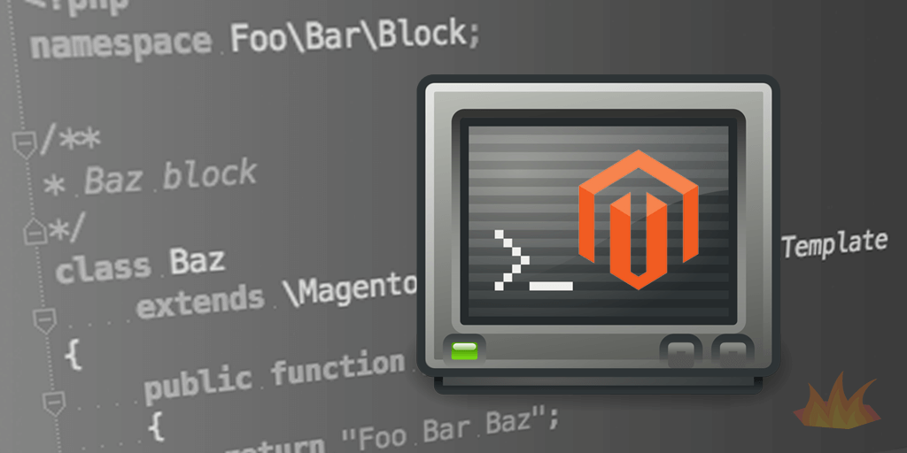

Hopefully you've already read <a href="/2015/07/22/setting-your-magento-2-module-right-way-composer-packagist#overlay-context=2015/09/03/using-docker-machine-os-x-dinghy">Setting Up Your Magento 2 Module the Right Way with Composer & Packagist</a>, so we can start creating our module. We won't use Composer or Packagist in this tutorial to save some time, as we are just writing code to test out functionality. Let's get right into things.

## Create module skeleton

First, we'll create a our module skeleton:

```plain
mkdir -p app/code/Foo/Bar/etc
```

Next, we'll create the module definition file:

<div class="gatsby-code-title">app/code/Foo/Bar/etc/module.xml</div>

```xml
<config xmlns:xsi="http://www.w3.org/2001/XMLSchema-instance" xsi:noNamespaceSchemaLocation="../../../../../lib/internal/Magento/Framework/Module/etc/module.xsd">
    <module name="Foo_Bar" setup_version="0.0.0"/>
</config>
```

With Magento 2, modules are not automatically picked up until they are enabled by command line. So let's enable the module. The `setup:upgrade` line is needed right now because of a bug in Magento 2, but this should only be needed in the future if there are database installer scripts in your module.

```plain
./bin/magento module:enable Foo_Bar
./bin/magento setup:upgrade
```

> Note that if you are running Magento through a Docker container, you should "bash" into the container first before executing shell commands: `docker exec -it CONTAINER_ID bash`

And with that, we're off to the races, as enabling a module also flushes the cache for us.

## Block class and Layout XML

Magento 2 is now aware of our module, so let's create our block class. We'll do this by extending the `\Magento\Framework\View\Element\Template` class, and create a custom `getName` function:

<div class="gatsby-code-title">app/code/Foo/Bar/Block/Baz.php</div>

```php{numberLines: true}
<?php
namespace Foo\Bar\Block;

/**
* Baz block
*/
class Baz extends \Magento\Framework\View\Element\Template
{
    public function getTitle()
    {
        return "Foo Bar Baz";
    }
}
```

Note the changes from Magento 1; specifically setting a custom namespace and the new format for extending a block template, along with the new class.

Now that we have programmed our block, we want to display it on the home page. The naming of the file is important as this is the new way of using layout handles. The `cms_index_index.xml` name will make our block only appear on the home page (`module_controller_action.xml`).

Create our folder location:

```plain
mkdir -p app/code/Foo/Bar/view/frontend/layout
```

Then create a layout XML file:

<div class="gatsby-code-title">app/code/Foo/Bar/view/frontend/layout/cms_index_index.xml</div>

```xml{numberLines: true}
<?xml version="1.0"?>
<page xmlns:xsi="http://www.w3.org/2001/XMLSchema-instance" xsi:noNamespaceSchemaLocation="../../../../../../../lib/internal/Magento/Framework/View/Layout/etc/page_configuration.xsd">
    <body>
        <referenceContainer name="main">
            <block class="Foo\Bar\Block\Baz" template="Foo_Bar::default/baz.phtml"/>
        </referenceContainer>
    </body>
</page>
```

The `referenceContainer` element is referencing the layout container for our block. To read more about layout containers, please visit the <a href="http://devdocs.magento.com/guides/v2.0/frontend-dev-guide/layouts/layout-overview.html" target="_blank">official documentation on layouts</a>. We also recommend reading thoroughly through the <a href="http://devdocs.magento.com/guides/v2.0/frontend-dev-guide/layouts/xml-instructions.html" target="_blank">XML instructions for layouts</a> to get a deeper understanding of the changes to the layout layer of Magento 2.

> Explore the core base container and block layout definitions by checking out the `layout` and `page_layout` folders in `app/code/Magento/Theme/view/frontend`.

## Template HTML and Caching

Next we'll create our folders for the template:

```plain
mkdir -p app/code/Foo/Bar/view/frontend/templates/default
```

Then the actual template HTML file containing:

<div class="gatsby-code-title">app/code/Foo/Bar/view/frontend/templates/default/baz.phtml</div>

```html
<h1><echo $block->getTitle() ></h1>
```

If you need to flush the cache for any reason (if the block isn't showing or was previously cached), you can do so with one of the following command lines depending on what cache you want to clear. Any changes to the layout XML will always require a cache flush with the `layout` param, while the new full page cache will need to be flushed on most PHP code changes.

```plain
./bin/magento cache:flush --all # Flush all cache types
./bin/magento cache:flush layout  # Flush Layout XML
./bin/magento cache:flush full_page  # Flush Full Page Cache
```


## Conclusion

And with a cache flush, refresh your home page and you should see Foo Bar Baz shown at the top of the main content area!

We've created a <a href="https://github.com/markshust/module-foobar" target="_blank">GitHub repository with this sample module code</a>, which will also be updated in the future with other code samples.
