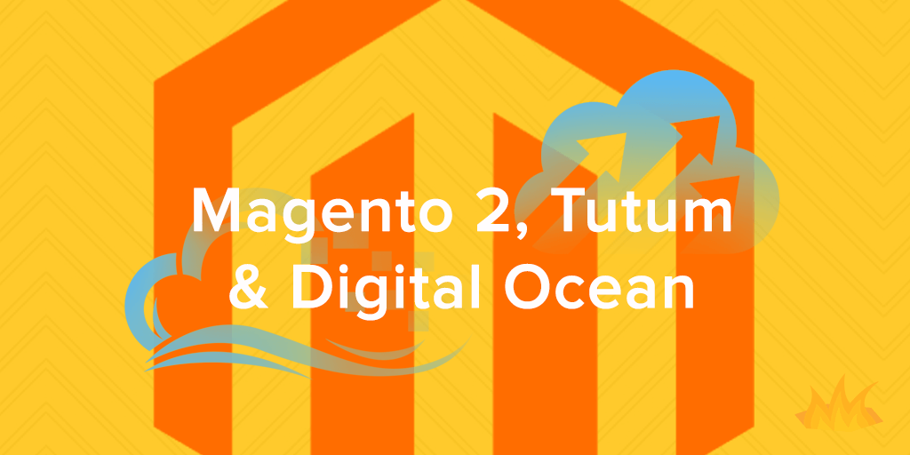

Tutum is a great deployment service for Docker-based services, and was just recently acquired by Docker. It provides a very simple way to deploy an entire Docker-based infrastructure.

## Pick a Cloud Provider

First, <a href='https://www.tutum.co/' target='_blank'>signup for a Tutum account</a>, then pick a cloud provider. Since we just want to setup a Magento 2 demo store and keep things simple, we'll pick Digital Ocean as they are very developer-friendly and affordable, however if you want to follow along with a different provider, the process is nearly the same. Go ahead and click 'Add Credentials', <a href='https://www.digitalocean.com/?refcode=187facf6e316' target='_blank'>signup with Digital Ocean</a>, and accept things to link it up. They'll even give you a $20 credit to get started.

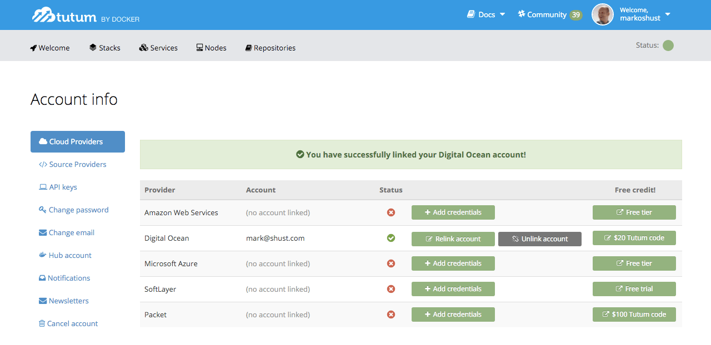

## Deploy a Node Cluster

After a cloud provider is setup, we'll create a new 'Node Cluster'. In this situation, a node cluster is basically a Droplet on Digital Ocean. Click on the Welcome tab and select 'Deploy your first node'.

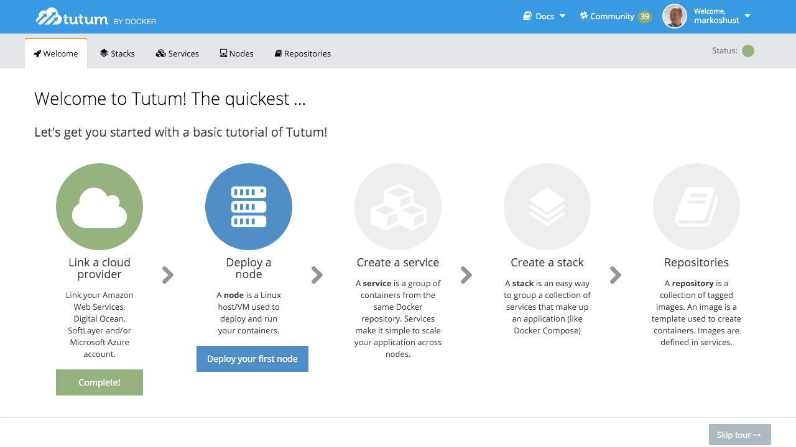

Let's name our node cluster 'magento2', pick a region, and pick a type/size of '2GB [2 CPUs, 2 GB RAM]'. This instance is a dual-core server with 2GB RAM. It's a bit puny for Magento 2, but it's enough for us to test out this setup, as the install process only uses around 1GB RAM. For number of nodes, just pick 1, so only one Droplet gets created. Fire it up with the 'Launch node cluster' button.

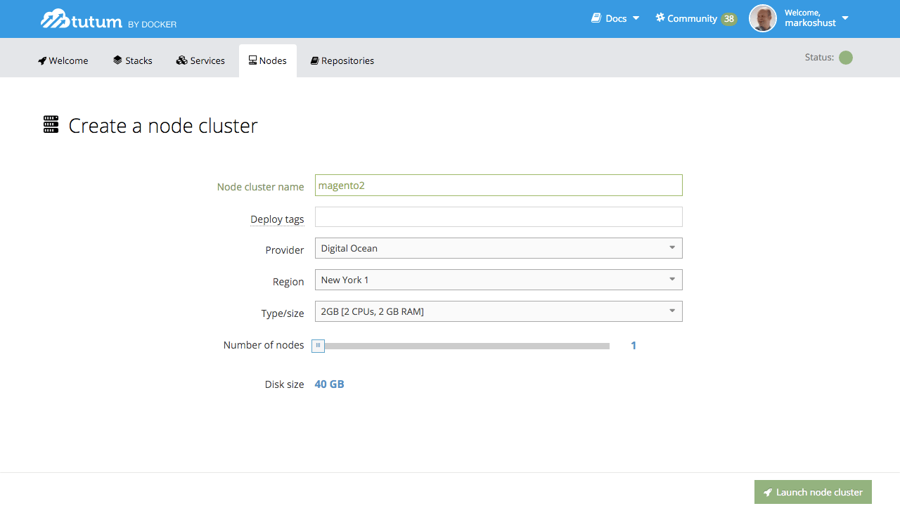

After launching the node cluster, you'll be sent to the main 'Nodes' screen, which will show the hostname of our node cluster. Copy this down, as we'll use this later to publicly access our Magento 2 instance. The domain will look something like `8dda32f1-markshust.node.tutum.io`. It may take up to 10 minutes for the node cluster to be deployed, so just wait until it's status is updated to 'Deployed', and then you'll know your Droplet is live.

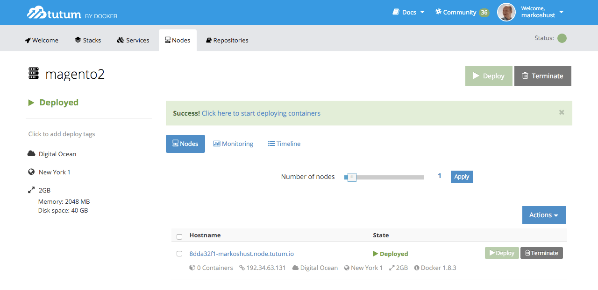

After your node cluster is in 'Deployed' status, you can head over to your Digital Ocean account to verify that it is deployed if you wish. You'll see a new Droplet created with the same hostname as what was given on the Tutum 'Nodes' page.

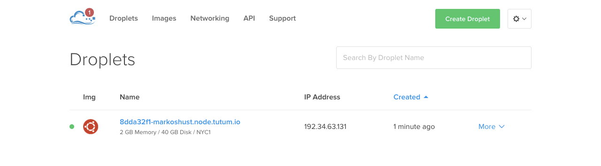

## Create a Stack

Now that our node cluster is deployed, we'll make a new 'Stack'. A 'Stack' is basically a set of containers that we want to deploy. A 'Stackfile' is just about synonymous with a docker-compose.yml file, so this makes things really easy to deploy if you are familiar with Docker Compose. Go to the 'Stacks' tab and click 'Create your first stack'.

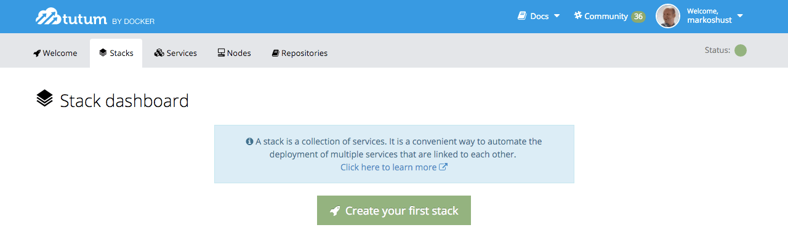

For 'Stack name' enter 'magento2', and under 'Stackfile' input the following (based on our <a href='https://github.com/mageinferno/magento2-docker-compose' target='_blank'>Magento 2 development docker-compose.yml file</a>). Note that this Stackfile has been slightly modified from our local docker-compose.yml development file to take things into account for a Linux environment, and the `M2SETUP_BASE_URL` environment variable has been updated with the hostname of our node cluster from the previous step (remember the trailing slash!). We are using the Composer-less <a href='https://hub.docker.com/r/mageinferno/magento2-setup/' target='_blank'>magento2-setup:2.0.0-sd</a> image for brevity of deployment, and so that we don't have to deal with extra Composer authentication keys.

<a href='https://github.com/mageinferno/magento2-stackfile/blob/master/Stackfile' target='_blank'>Stackfile</a>

```yaml
app:
  image: mageinferno/magento2-nginx:1.9.9-0
  ports:
    - '80:80'
  links:
    - php-fpm
    - db
  volumes_from:
    - appdata

appdata:
  image: tianon/true
  volumes:
    - /src

php-fpm:
  image: mageinferno/magento2-php:7.0.0-fpm-0
  links:
    - db
  volumes_from:
    - appdata

db:
  image: mariadb:10.0.22
  ports:
    - '3306:3306'
  volumes_from:
    - dbdata
  environment:
    - MYSQL_DATABASE=magento2
    - MYSQL_PASSWORD=magento2
    - MYSQL_ROOT_PASSWORD=magento2
    - MYSQL_USER=magento2

dbdata:
  image: tianon/true
  volumes:
    - /var/lib/mysql

setup:
  image: mageinferno/magento2-setup:2.0.0-archivesd-0
  links:
    - db
  volumes_from:
    - appdata
  environment:
    - M2SETUP_DB_HOST=db
    - M2SETUP_DB_NAME=magento2
    - M2SETUP_DB_USER=magento2
    - M2SETUP_DB_PASSWORD=magento2
    - M2SETUP_BASE_URL=http://8dda32f1-markshust.node.tutum.io/
    - M2SETUP_ADMIN_FIRSTNAME=Admin
    - M2SETUP_ADMIN_LASTNAME=User
    - M2SETUP_ADMIN_EMAIL=dummy@gmail.com
    - M2SETUP_ADMIN_USER=magento2
    - M2SETUP_ADMIN_PASSWORD=magento2
```

Let's now launch our stack by clicking 'Create and deploy'.

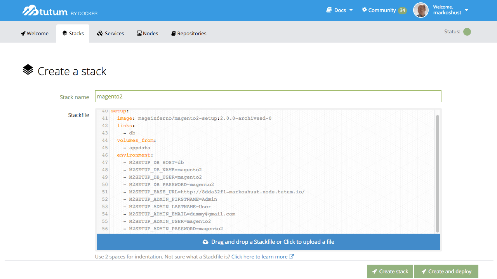

## Monitoring Services/Containers

Tutum will now launch and run all of these service/container definitions, including the 'setup' container, which runs a command line script that automatically installs Magento 2.

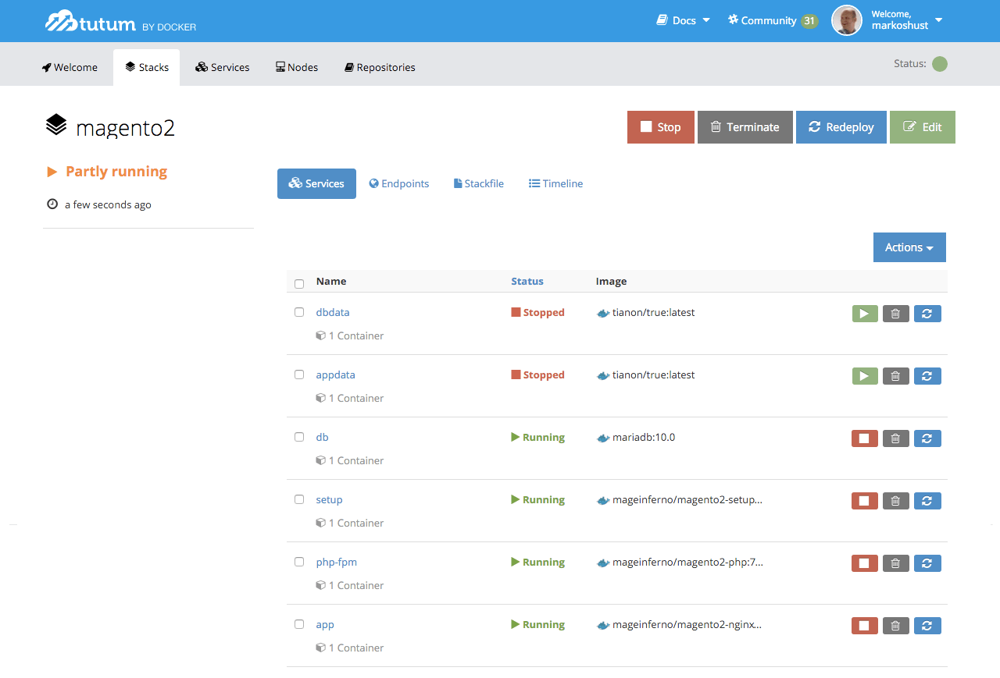

Don't worry about the 'dbdata' or 'appdata' containers being in a 'Stopped' state -- this is normal, as these containers are always in a 'Stopped' state because they are just used as persistent data stores for our app & database and therefore don't run. But don't delete them! Otherwise you'll also delete the application and database data stores.

You can monitor the status of the installation once the 'setup' container is in 'Running' status by clicking on 'setup' under the Services tab, and then clicking 'Logs'. It'll take a few minutes for the setup process to complete, so just hang tight for a few.

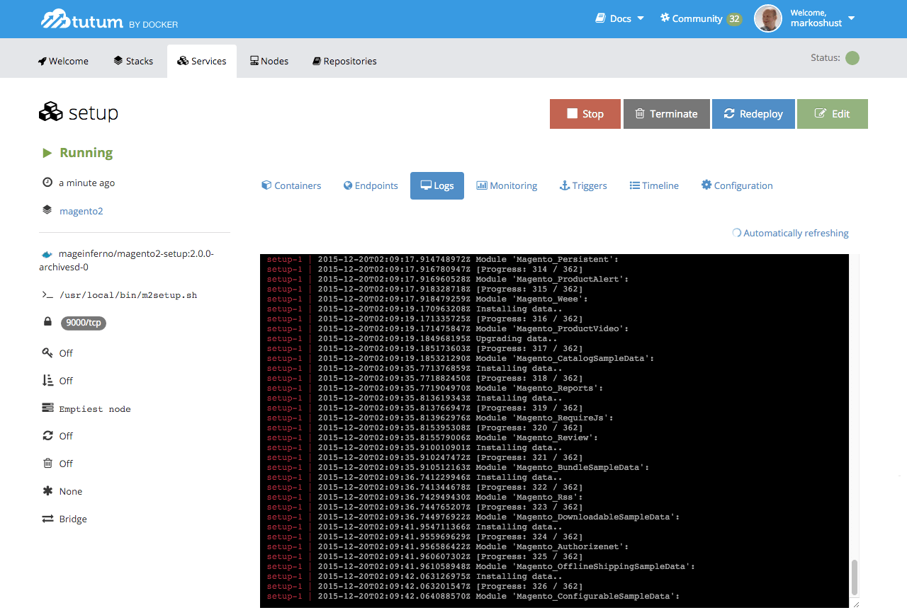

## Installation Complete

You may now visit your site at your Tutum hostname (for me, that is `http://8dda32f1-markshust.node.tutum.io/`). Note that the first few clicks around our new Magento 2 demo store will take some time to initially load, but return visits will be much quicker. This is because the store hasn't yet been optimized & setup for production, and is really just to be used for development and/or testing purposes as the first step of deploying to a containerized architecture in the cloud.


We are still working out details on production-quality builds for Magento 2, but hopefully this will start get you thinking about possible methods of deploying Magento 2 to a container architecture service like Tutum & cloud provider like Digital Ocean. We at Mage Inferno strongly believe that Docker and containers are the future to cloud-based hosting, and with the correct pieces in place, you can build & deploy resilient, scalable, and highly-available architectures.

## BONUS: Custom Domain Setup

If you want to use a custom domain with Tutum and Digital Ocean, it is actually quite easy. First, login to Digital Ocean and go to the 'Networking' tab. Under 'Domains', enter your custom domain, select your Droplet and click 'Create Record'.

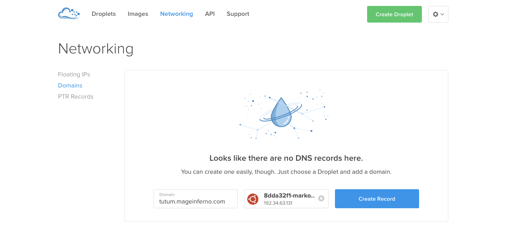

Now you can create an A-Record at your DNS provider for whatever domain name you want to use, using the IP address of our node cluster. I created an A-Record of 192.34.63.131 pointing to my custom hostname 'tutum.mageinferno.com'.

After this is complete, let's head back to Tutum and go to our 'app' service, then click Terminal. What we need to do is grab our admin URL. In Magento 2, this is randomized with every install, which is great because it prevents brute-force hacking.

When on the terminal, just enter the following command:

```bash
head -5 app/etc/env.php
```

This will show us the first 5 lines of app/etc/env.php file, the last of which contains our admin URL. In this case, it is `admin_18a3o6`. Let's append that to our original Tutum hostname to give us the URL of `http://8dda32f1-markshust.node.tutum.io/admin_18a3o6`.

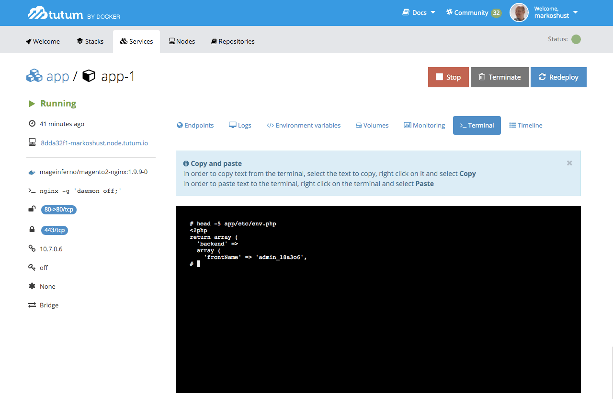

Once logged into the admin (using the credentials in our Stackfile, by default `magento2`:`magento2`), go to Stores > Configuration, then click on the 'Web' tab. Here, we'll see the Base URL of our Magento 2 store. Now just enter your new hostname, which in my case is `http://tutum.mageinferno.com/` (remembering the trailing slash).

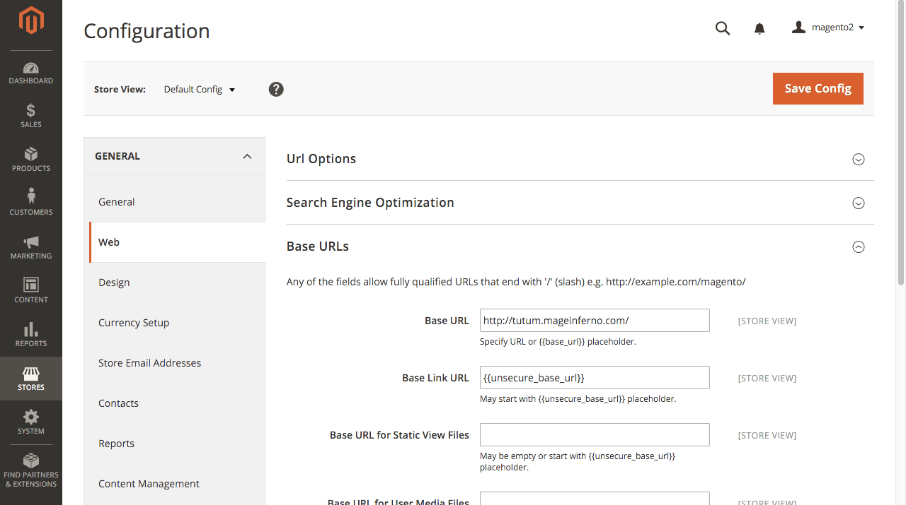

Upon saving this record (and once DNS propagation completes), you'll notice that your Magento 2 demo store is now pointing at your custom domain.
