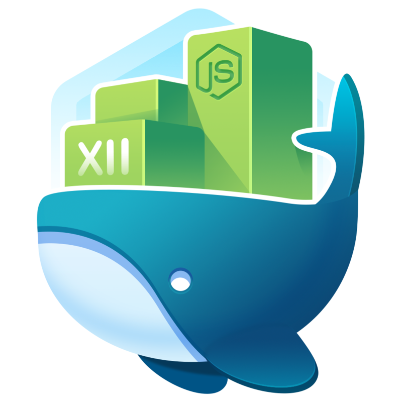

I've been working on a full-blown course for <a href="https://egghead.io" target="_blank">Egghead</a> the last few months and it has finally been published!

I'd highly recommend this course as it covers each of the twelve-factors separately, and how they relate to Node.js and Docker.

[Build a Twelve-Factor Node.js App with Docker - Click Here to watch on Egghead.io]((https://egghead.io/courses/build-a-twelve-factor-node-js-app-with-docker))

In this course we will take a simple Node.js app that connects to a MongoDB database and uses an Express web server, and learn how to setup a full software development deployment process as well as how to properly “Dockerize” the app.

We’ll step through setting up proper version control techniques, managing configuring within the environment, setting up proper build/deploy/run processes, and all with abiding by Docker best practices. We’ll also make sure our deployment is setup for scale, and have consistent development practices in place for reliable app deployments.
