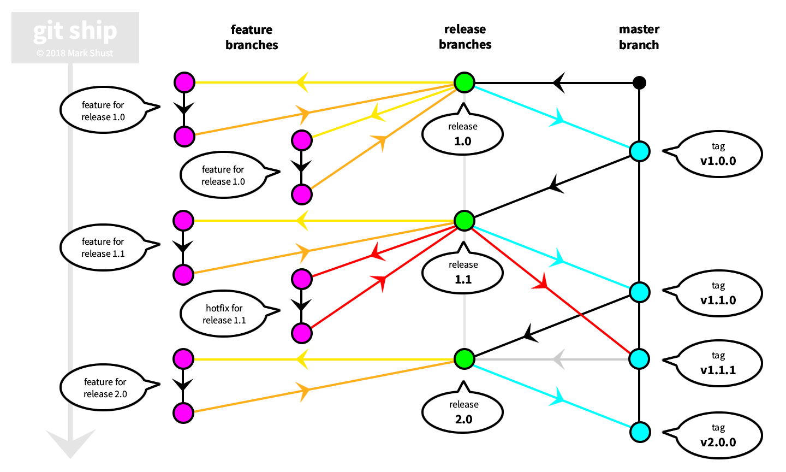

Ever since I started using git, I was enamored by the nice streamlined process of [git flow](http://nvie.com/posts/a-successful-git-branching-model/). It proved to be a very reliable workflow process for managing features, releases and fixes within a team environment, and added some much-needed structure to git.

Fast-forward 8 years, and it leaves much to be desired. At times I found myself endlessly merging branches, sometimes forgetting to create the numerous pull requests into different branches for hot fixes, and also wondering why we needed a develop branch at all. There must be a better way?

I was completing work on a [Screencast Course for Docker](https://egghead.io/courses/build-a-twelve-factor-node-js-app-with-docker), and the first lesson in that course is how to use git flow; [codebase is the first step of building a Twelve-Factor App](https://12factor.net/codebase). Recording the screencast numerous times, I realized how tedious development in git flow could actually be, and noticed some possible shortcuts that could be taken, while still leaving the process intact. Over the last 6 months or so, I've built and concluded in a brand new simplified workflow called "git ship"; heavily inspired by git flow, b but focused on shipping code instead of merging branches.

Let's start with looking at git flow. If you have been using git for any amount of time on a team larger than zero, you have probably encountered this well thought-out workflow.

However, you will see that there is merging everywhere; merging a feature branch into develop, merging develop into a release branch, and merging a release branch into develop. Oh, and I didn't even touch base with hotfixes; a simple hotfix requires sending pull requests into both develop and master branches, and given the above diagram, is never actually merged into a release branch. (Could it become lost along the way? Yes, yes it can.)

I started to question everything about this process. It appeared `master` branch really was underutilized, and the `develop` branch was over-utilized. I never really seemed to have issues with `feature` branches, but why did a hotfix follow a different workflow? It seemed as though I was merging branches way too much. Was there a way to ship software quicker, but following a similar workflow?

Meet `git ship`, a heavily simplified version of `git flow`:

**Key takeaways:**

- new branch created for every release from master [`release/1.1`]
- staging looks at current/active release branch [`release/1.1`]
- when release branch code is ready to be released:
  - merge from `release/1.1` into `master`
  - tag release [`v1.1.0`]
  - deploy to production from tag [`git checkout tags/v1.1.0`]
- after every release, create next release branch from `master` [`git checkout -b release/2.0 master`]
- when hotfixes are needed, branch the hotfix changeset from the specific release [`git checkout -b feature/123 release/1.1`]
- pull requests for hotfixes merge from branch `feature/123` into branch `release/1.1`
- when all hotfixes are complete, merge release branch into `master` then deploy as usual with new tag [`v1.1.1`]
- merge `master` back into active release branch [`release/2.0`]

**Deployments**

- any new commit pushed to release/* should trigger build and deploy to staging
- new tag pushes trigger release to production

**Master Branch**

- master only ever contains production-ready code
- tags only made from master

**Usage**

- Works best with agile/scrum-based methodologies
- Doesn't work with continuous integration/deployment processes
- Works well with small teams (projects with less than 10 developers).

You'll notice one big difference right away; gone is the `develop` branch. We're focusing entirely on releasing software on a timely schedule, so the `develop` branch really doesn't benefit us. Note that the concept of a "working tree" still does exist; however, it is based on whatever the release branch is at the time. I call this the "moving working tree".

The "moving working tree" concept only works if we are constantly pushing code forward. Code starts it's life on the master branch, which only ever contains production-ready code. Our number one priority is to ship code, so we immediately focus on this by creating a `release` branch which is branched from master. Feature branches are created off of this current release branch, and are iterated through as usual within a local development environment. The "staging" server always looks at the current release branch, and is where we test integrated code.

You can think of every release tied to a 2-week sprint. Since the goal of sprints is to ship code at the end of every sprint, this aligns perfectly. After you have fully tested your code on staging and it is ready to be released, you can merge the release branch into master, which is the only way to get code into master. Then, we tag the release, to signify a specific release on the branch at this point in time. We then deploy that tagged version of code to production.

After code is pushed to production, a new release branch is created from master, and the process is repeated. Let's say you have a code freeze for the last 2 days of the sprint, but what to start on the next release? No worries. Just create a new release branch based on the current release branch, and start coding. In this situation, we just need to make sure to merge the master branch back into the new release branch after code makes it's way into that branch. Note that since master only ever contains production-ready code, it is *always* ok to merge master back into the current release branch. But, we don't want to move code in master back into an old release branch; remember, we always move forward so the concept of our moving working tree stays in-tact.

Hotfixes also get tremendously easier. Now, a hotfix works exactly like any other feature, as long as we make sure to branch our new hotfix branch off of the release branch of where the fix is to be applied. But doesn't this break the concept of our moving working tree? Not at all, as once the code has been merged into the release branch and merged into master, we will pull that code forward and also merge it back into our current release branch.

Modern deployment processes such as Bitbucket Pipelines can be setup to look at wildcard branches. We have to make sure we setup all pushes to `release/*` to automatically build and release to our staging server. This is pretty neat, as our staging server will automatically look at what currently needs to be tested. A push of an old release branch will automatically push out code tied to that old release branch so we can test a hotfix. And also, any pushes of our current release branch will also be pushed to staging. These deployments can be passively managed through the merges of these branches; want to hold off for a little while longer to test that hotfix? No worries, just put pull requests on hold as long as needed, or setup an additional staging server for your complex needs and requirements.

You'll also want to make sure that the "main branch" within Github or Bitbucket is pointed at your current release branch, so pull requests automatically default to get merged into this release branch. This can be easily updated by a system administrator at the end of every sprint.

Questions? Comments? I'd love to hear feedback on this new workflow and your experiences with the updated process. I truly believe this updated workflow process can help mitigate unneeded complexity and help do what you do best as developers: ship software.
