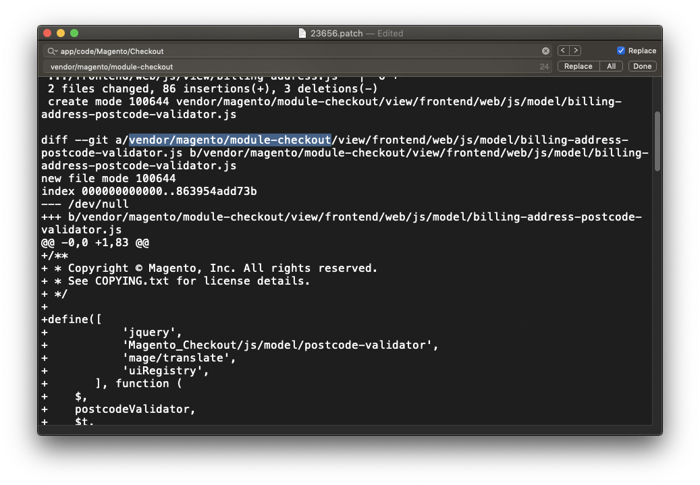
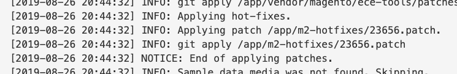

Recently a visitor to a Magento website reported an issue with checkout. After some research, it lead me to <a href="https://github.com/magento/magento2/issues/22112" target="_blank">issue 22112</a>, which has a <a href="https://github.com/magento/magento2/pull/23656" target="_blank">related pull request</a> which fixes the issue. If you notice the last comment on issue 22112, it is resolved and slated to be released in version 2.3.3. Unfortunately, the client is currently on 2.3.1, which leaves us in a precarious situation. Since Magento 2.3.3 will <a href="https://twitter.com/mattz_mg/status/1165987249009438721" target="_blank">most likely not be released until October</a> (it's August at the time of this writing), we need a workaround to get the changeset merged into our current codebase ASAP. Luckily, Git and patch files make this possible without too much effort.

Our first step is to find the corresponding pull request for the patch we want to apply to our current store. As pointed out before, the web address for the desired pull request is available at <a href="https://github.com/magento/magento2/pull/23656" target="_blank">https://github.com/magento/magento2/pull/23656</a>.

There's a neat trick for GitHub we can use to get a related patch file for this pull request. All we need to do is append a `.patch` extension to the pull request URL. This leads us to the patch URL location of <a href="https://github.com/magento/magento2/pull/23656.patch" target="_blank">https://github.com/magento/magento2/pull/23656.patch</a>.

Next, we will download this patch file to our local filesystem. Projects based on Magento Cloud have access to a special helper directory named `m2-hotfixes`. Any patch files located within this directory will be automatically applied to the source code at the time of deployment. If you do not currently have a folder named `m2-hotfixes` or do not use Magento Cloud, no worries! Just create a directory of this name within the Magento root. Afterwards, go into that directory and download the patch file:

```bash
curl -O https://github.com/magento/magento2/pull/23656.patch
```

This will place our patch file at: `m2-hotfixes/23656.patch`

There's one "situation" we need to account for if Magento instance is Composer-based (practically every install of Magento). The main Magento 2 repo uses the directory structure `app/code/Magento/...`, however Composer uses the directory structure `vendor/magento/...`. In this case open up `23656.patch` in your favorite text editor (I'm a big fan of TextEdit!), and find & replace Composer directory references. In this example, we will search for:

`app/code/Magento/Checkout`

and replace it with:

`vendor/magento/module-checkout`



You'll need to go through the changeset and update the filesystem references where appropriate.

Once the file is updated and saved, commit it and Magento Cloud will automatically apply it on the next deployment. You can confirm the patch is applied by checking your deployment logs and looking for the log reference which applies the patch:



If you aren't using Magento Cloud, you can <a href="https://devdocs.magento.com/guides/v2.3/cloud/project/project-patch.html" target="_blank">apply custom patches</a> directly to the codebase. The command to manually apply this patch is:

```bash
git apply m2-hotfixes/23656.patch
```

Hopefully this will help you and your client in that certain situation where you are stuck dealing with a bug which is resolved, but just cannot wait for the next release version to apply that update to your source code.
