It's been almost 6 years since I wrote [A programmer's ergonomic workstation](/2014/03/31/programmers-ergonomic-workstation/). A lot has changed 😃. Since that blog post I've moved to a new home, got more into screen & video casting, and wanted to expand upon on my previous workstation setup. I've learned some lessons over the years, and have tweaked my home office into what I believe to be a very comfy and ergonomically friendly workstation.

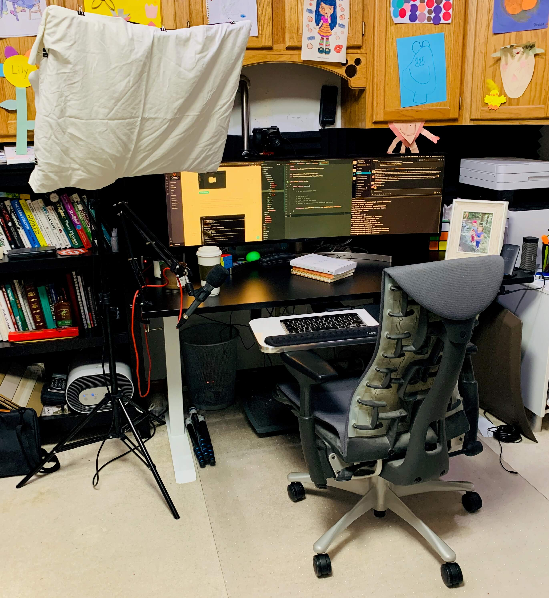

The main thing you want to achieve in your home office is proper ergonomics, so your body placed into a correct posture & position. The two most important things you need are a great chair and a great table. Almost everything else is secondary, but every item you can improve upon will help out your body in the long run.

# Ergonomics

## The chair

Having a great ergnomomic chair is the single most important item you need to be comfortable working all day. I previously went through quite a few $60 chairs from Office Max and Big Lots, a couple thin mesh chairs which worked "ok" but not for all day, and things like exercise ball chairs or just standing all day. **If you want to be comfortable all day during and after work, investing in an unbelievably comfortable, quality chair is a must.**

I strongly advise to locate a high-end office furniture close to you, so you can try out many different chairs before purchasing one. The only place close to me is <a href="https://www.agofficefurniture.com/" target="_blank">A & G Office Furniture</a> in downtown Cleveland. They happen to be a reseller for <a href="https://www.hermanmiller.com/" target="_blank">Herman Miller</a>, which if you haven't heard of, is one of the most reputable sources for ergonomic chairs. Other notable names who are popular and make ergonomic chairs are <a href="https://www.steelcase.com/" target="_blank">Steelcase</a> and <a href="https://www.humanscale.com/" target="_blank">Humanscale</a>.

You really can't go wrong with any of these premium brands, but you can go wrong if you don't find the chair that's right for you. Chairs are generally very personal, and your level of comfort will be determined by finding the chair that feels like it was made for you. I don't believe you can find a new really quality chair for under $500 -- it's just not possible. Because of that if you are on a budget, I would recommend searching around either Facebook Marketplace or look for offices or startups in your area which have shut down or are being liquidated, and picking up a good used quality chair. You may be able to find a Herman Miller Aeron for as little as a couple hundred bucks at the failed startup near you.

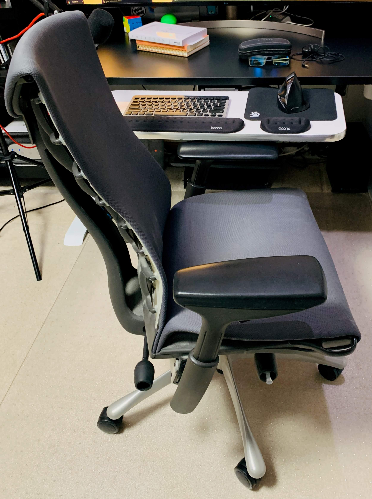

I liked purchasing from A & G because I was able to customize the color and options of my chair, which I ultimately decided on a <a href="https://amzn.to/2Q5emQW" target="_blank">Herman Miller Embody</a>. I picked a slate gray color, white backing, silver legs with black standard casters. I don't regret any of these choices - the chair looks and feels fantastic!

I got the chair many years ago for roughly half the price of the going rate (around $900), mainly because it was new at the time and it didn't have many reviews. The Aeron was my second choice, but those chairs have a ridiculous number of levels of adjustment, and changing the level involves turning a knob basically 200 times to get your desired effect. And if you want to change it back, it takes another couple hundred turns. The Embody has a very simple single knob which is easy to turn and only has about 7 levels of adjustment if my memory serves me correct.

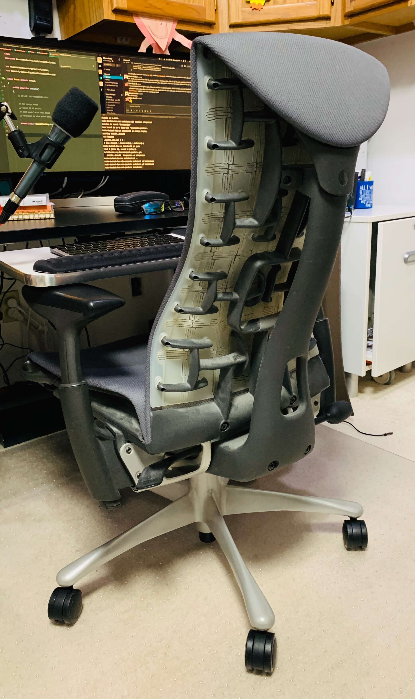

The skeleton structure on the back of the chair is also extremely supportive for your entire back. I've dealt with major lower back pain issues since I was about 12 years old (I don't think it is a coincidence that is about when I got into computers 😜), so back support is the most important feature in a chair for me. The armrests are also fully adjustable, and the lock feature works ok, even though I wish a few more lock levels existed.

My new home office has carpet. I decided to not put laminate down like in my old office, because the carpet provides some additional warmth & comfort to the room and also absorbs a massive amount of sound. I'm very susceptible to loud noises, and having two 5 year old girls at home anything I can do to dampen noise is helpful. I got a <a href="https://amzn.to/2te1m2g" target="_blank">48" x 60" Marvelux Polycarbonate Chair Mat</a> for the chair to roll around on, which is way heavier than the cheap mats you find at Staples that eventually cave in on places and crack. The Embody chair weighs over 60 pounts, so the chair mat will inevitably break if it's not heavy and quality.

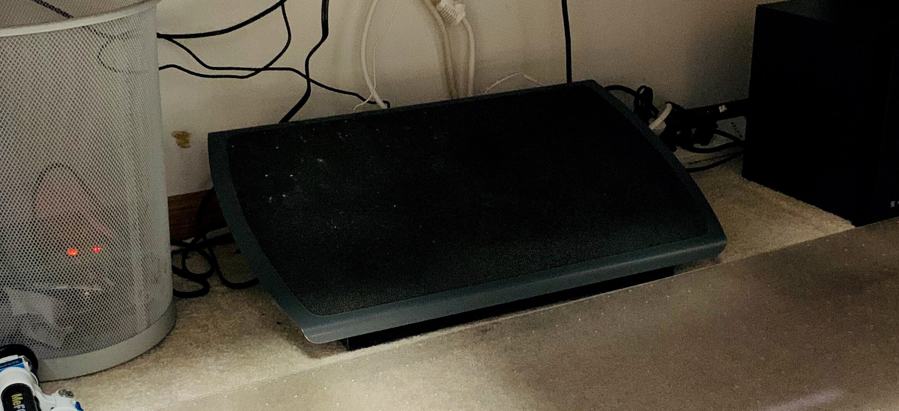

Another quick note: there is an usual amount of stress on your feet when you don't have a comfy place to put them. I have a <a href="https://amzn.to/2ryQ8VK" target="_blank">3M Adjustable Foot Rest</a>, which puts your feet at a nice angle and takes a bit of stress off of them. You wouldn't thik it would make a big difference, but it definitely does! I liked the 3M because it was very heavy and fully adjustable, so it won't slide around your floor mat and you can get (and lock) your feet into a comfy position if you wish.

## The table

This is an area I finally splurged on. Years ago when I was putting together my previous home office, ergonomic sit/stand desks were extremely unaffordable for me ($1500+). It's just a table, right?

Fast-forward a few years and they are now just a few hundred bucks. Tables are in fact just tables, but sit/stand desks are entirely different. Bringing up my back issues again, it feels like my body cramped up after a couple hours and my spine kept "locking" into place. Even something fancy like an Embody chair doesn't fix this. I don't really work out (trying to change that!), and am pretty much sedantary the entire day. My Apple Watch helps remind me to stand ever hour, but it's typically a one minute walk and then back at my desk.

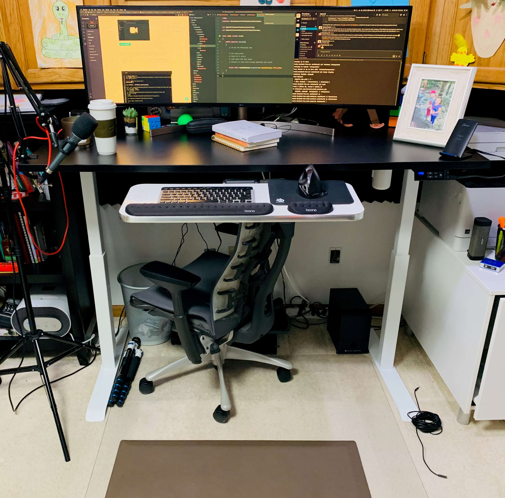

I decided to get a <a href="https://amzn.to/2SykAdL" target="_blank">AITERMINAL motorized desk frame</a> and couple it with a <a href="https://amzn.to/2ZvhBUZ" target="_blank">30" x 60" Titan Desk Top</a>. At the time I was a bit concerned about mixing and matching a frame with a desktop, but based on some reviews by others it seemed pretty straight-forward. Again, I am completely satisfied with my decision, and the final result is pretty awesome, all for under $500!

The table goes down to about a 28" height, and due to my cabinetry I can only go up to about 44" high. I stand about 6 feet tall, and this height is great, especially since I can adjust my screen upwards to my view. I ultimate decided on AITERMINAL becuase it looked to be of great quality (it is indeed), is of a nice weight, and raises and lowers very quickly. I raise and lower the desk 3-4 times a day, so having it be electric was a must.

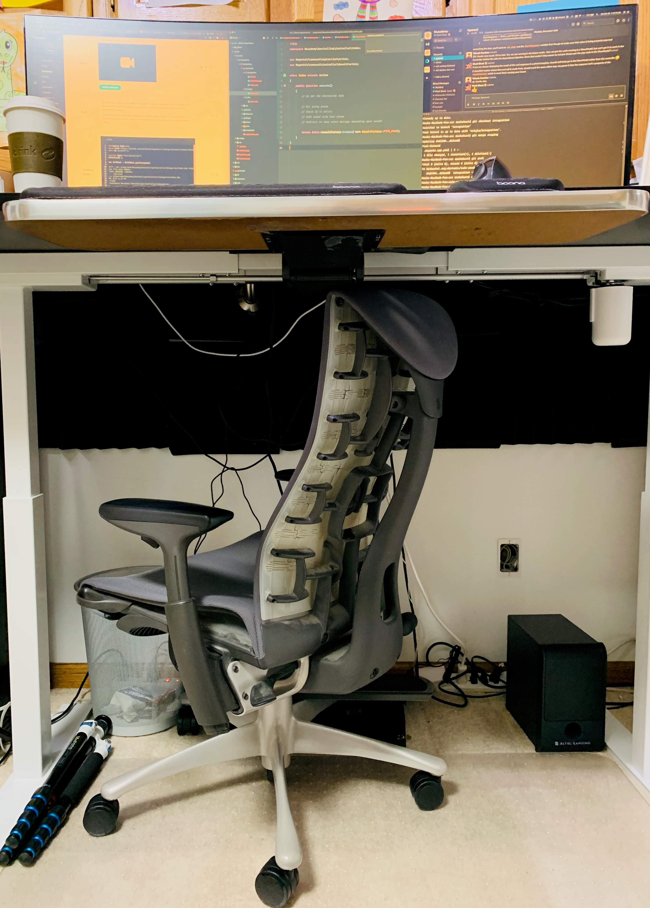

One thing to note about electric desks if you have surrounding cabinetry or items on or below your desk - be careful! I have very tight height constraints from my cabinetry, and if you aren't careful when raising or lowering your desk, you can destroy stuff including your table or frame. Always remember to move items away if needed. For example, I always tuck my chair underneath the desk, and if I don't remove it before lowering it again and use the auto-lower function, it will most likely tear apart the desk and destroy the motor.

That said, I wouldn't even think of getting a manual/crank desk because the price of electric desks has dropped so much. With electric desks, make sure you get one with a couple memory functions, so you can raise and lower your desk very quickly without thinking about it, and ensure the height is set to safe levels. It's great to know that I have less than 1" of clearance, and I can trust the memory to raise it to my max safe height and not crush into my cabinets. It also has a lock feature, so my little girls can't destroy my office (well, at least it helps).

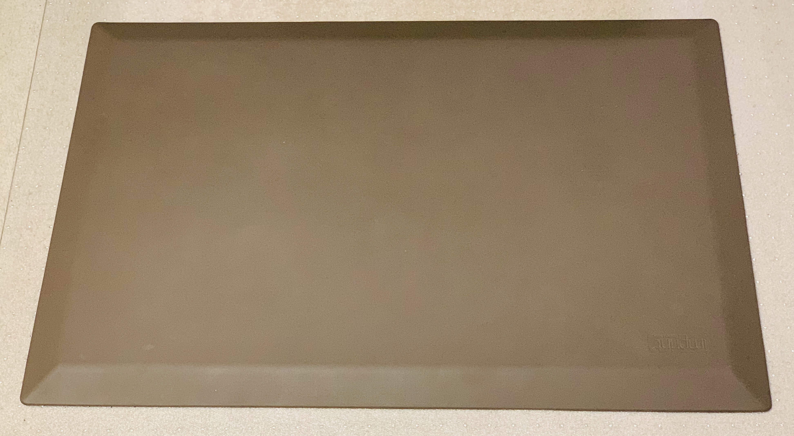

When standing your legs will get stressed out and tire very quickly. Because of this, I'd recommend getting something like the <a href="https://amzn.to/2ZDW6Bu" target="_blank">Imprint CumulusPRO Anti-Fatigue Mat</a>. I picked this one because it is very heavy & thick, and has a super large standing area. It moves out of the way easily, and doesn't slide on the carpet mat at all.

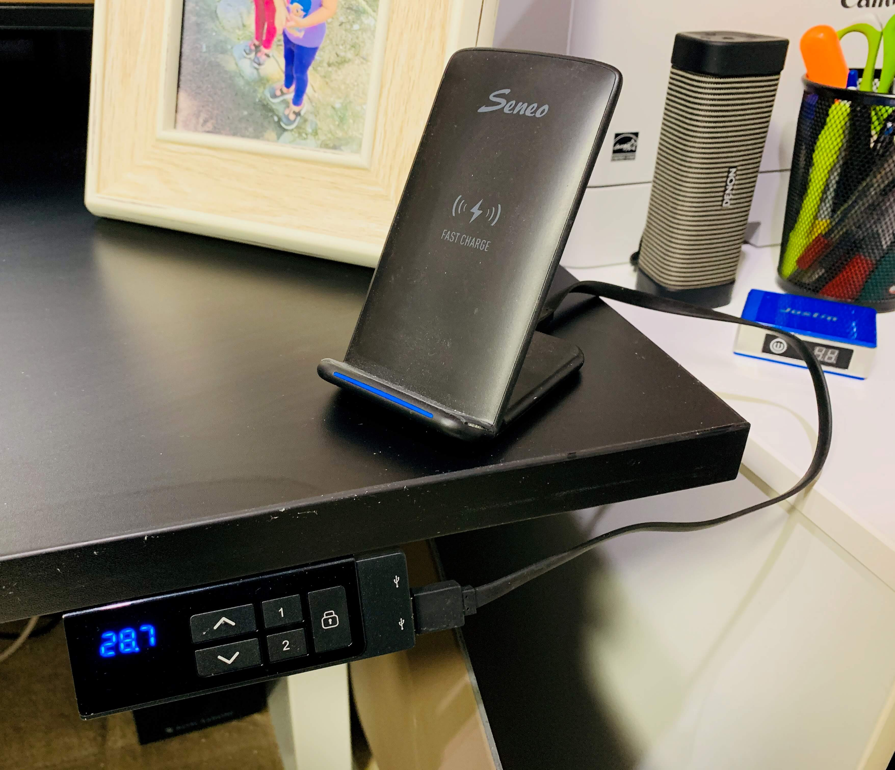

I thought the USB power port would be useless, but it's actually so extremely useful. My phone charger is typically always plugged in there, and I don't need to worry about cords being ran over my desk or in the way of my monitor. I use it often and quite frequently.

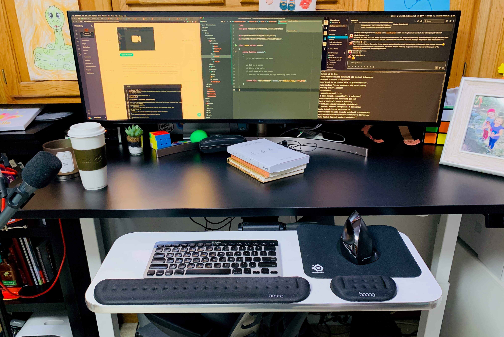

> Side note: I'm a Rubiks cube geek. Everyone knows the original one is hard to turn, so I love my <a href="https://amzn.to/2QvYLsA" target="_blank">MoFang 3x3x3</a>. It pairs well with my <a href="https://amzn.to/2Qo619Y" target="_blank">Rubiks Tissue Box</a> which I saw on Big Bang Theory and just had to have.

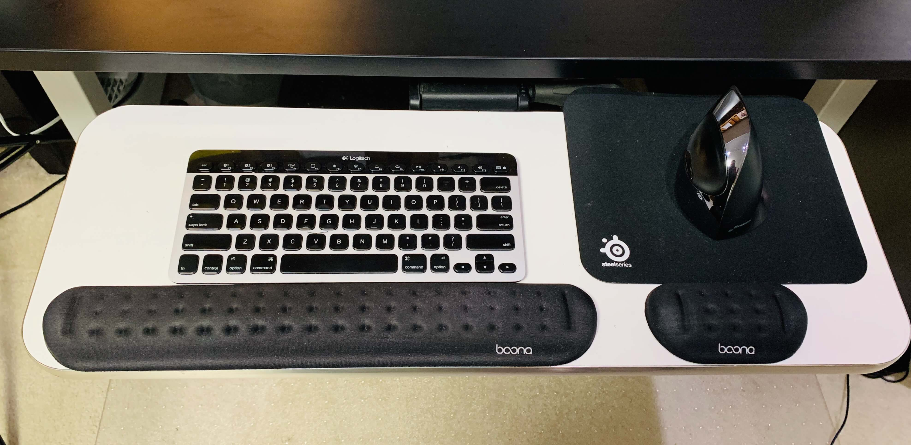

Attached to my table top is a <a href="https://www.versatables.com/deluxe-pivoting-keyboard-arm-and-tray" target="_blank">28" VersaTables Deluxe Keyboard Pivoting Arm and Tray</a>. This is the same one as my previous setup, and 6 years later it still looks like new. The 28" version will allow you to hold a keyboard and mouse easily. The pivoting arm makes this fully adjustable and you can angle the tray negative or positive degrees to your liking. You want to make sure the keyboard is located below your normal desk, so your arms can be located at a 90 degree angle to retain a correct posture.

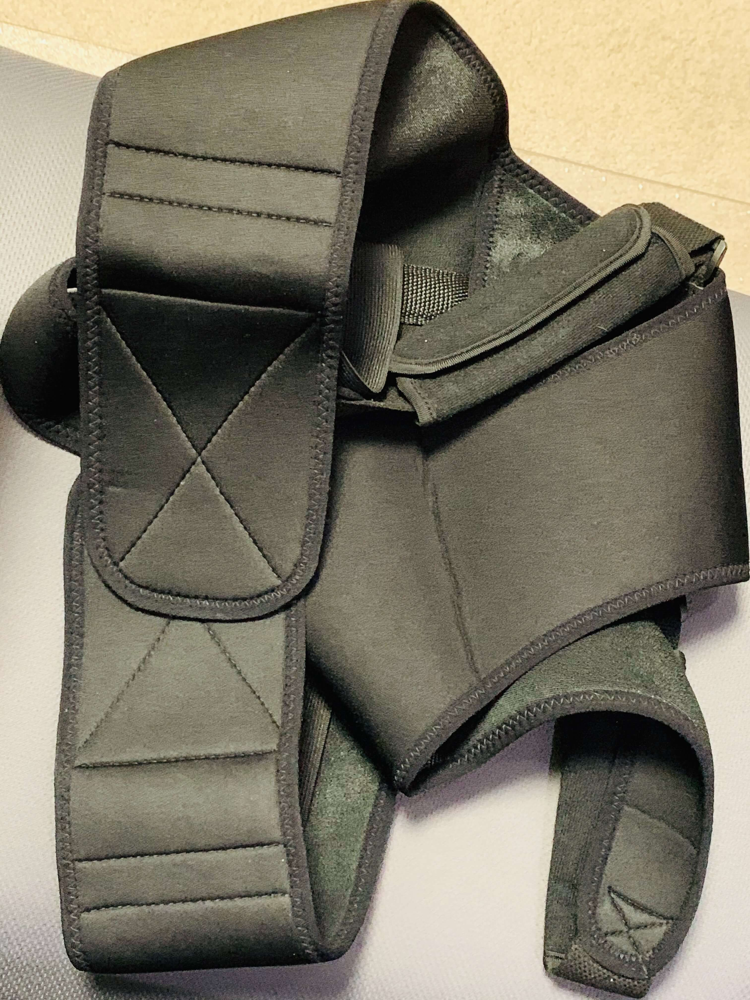

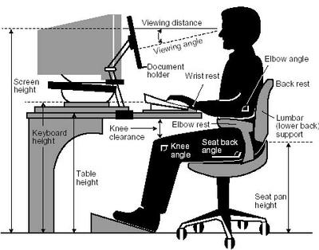

> Speaking of posture, for Christmas I asked for and got the <a href="https://amzn.to/2FcZn1j" target="_blank">FlexGuard Posture Corrector</a>. I've had horrible posture my entire life, from school through working in an office. I've only had it on a day, but it's fairly non-evasive and seems to throw my upper back into the correct position. It's definitely reinforcing me having a more correct posture, and I hope it trains me in the long run so I no longer need it.

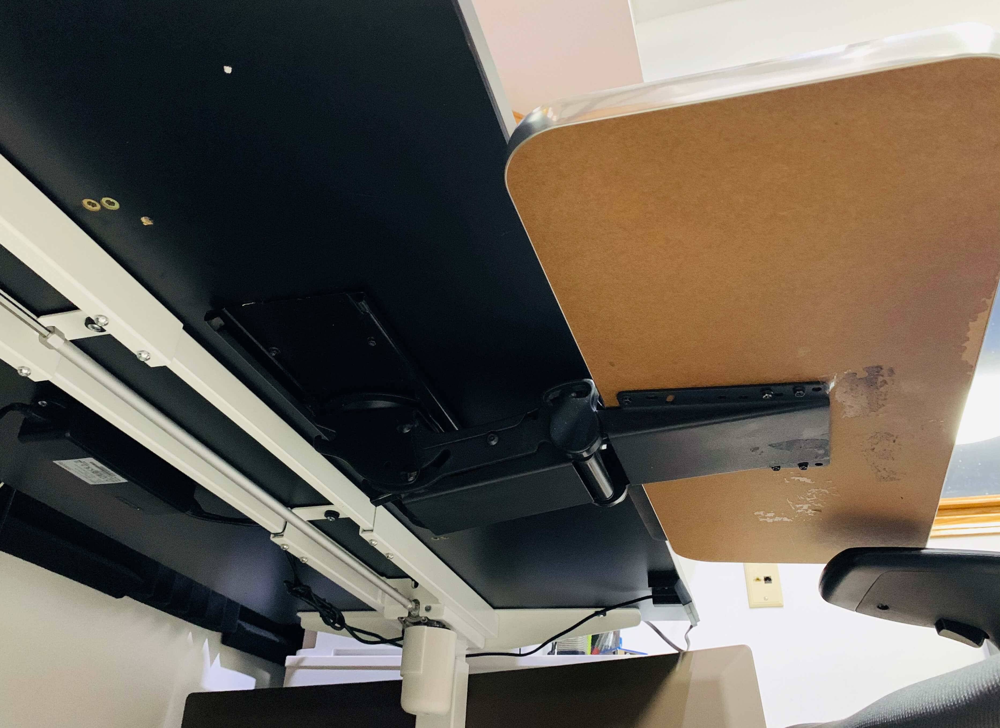

Note that because of the placement of the crossbar on sit/stand desks, you'll have to mount the keyboard tray sideways. This doesn't seem to be much of an issue, because I want it at pretty much the same position every day anyways. If you don't get a VersaTables keyboard tray, make sure the one you get rotates 360 degrees so you can mount it sideways on sit/stand desks.

I went through literally 5 Apple keyboards (apparently I type hard) before settling on the <a href="https://amzn.to/365Lq0Q" target="_blank">Logitech K811</a>. There are probably better versions of this keyboard out now, but after about 8 years I'm still pounding hard on this thing. It illuminates at night and the battery lasts a couple weeks between charges, which can be done with a USB cable.

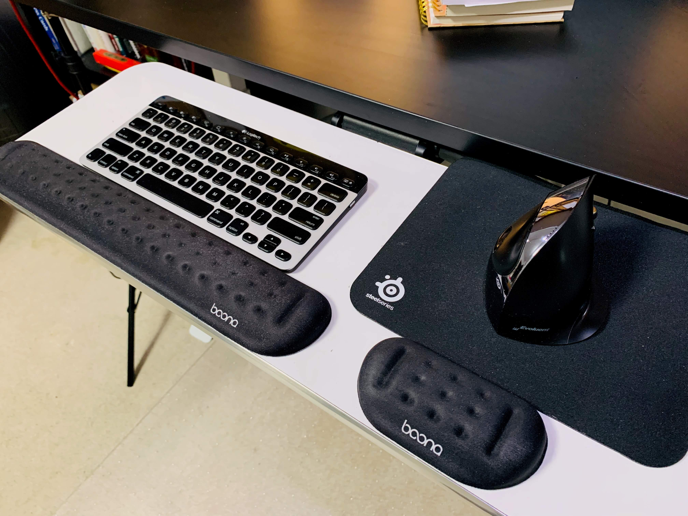

My mouse is an <a href="https://amzn.to/35a8BpC" target="_blank">Evoluent VMCRW Vertical Mouse C Right</a>, which has basically replaced the <a href="https://amzn.to/2Sz4rVj" target="_blank">Wacom Intuos Pro Medium</a> that I've basically used the last 15 years. I used to have horrible carpal-like symtoms, and my wrist would cramp & feel bent out of place. The Wacom was great, but still positions your wrist at an odd angle. The Evoluent keeps your wrist in a somewhat natural position, so that twisting feel is almost gone now. I tried other Vertical Mice that were cheaper, but they were total disasters. I can vouch for the Evoluent (even though Amazon's reviews of it are low) -- it's amazing and well worth the $100 or so. The cheap ones don't put your wrist at a good angle, or have issues with cursor tracking or running out of battery.

My wrists actually still hurting a bit, so I decided to get the <a href="https://amzn.to/2Q3W2I1" target="_blank">BOONA Wrist Rest Kit</a>. The height of wrist rests is usually much to high to use with my Logitech and wrist rest kits typically didn't have matching heights for both the keyboard and mouse 🤯, so I painlessly searched until I found this set. It provides enough cushion but is definitely on the firmer side, but at least it accomplishes it's task because my wrist pain helped go away with it.

## The screen

I'm not sure if the screen belongs in this post, but if I don't include it, everyone's first question is always "What in the world is that giant screen?".

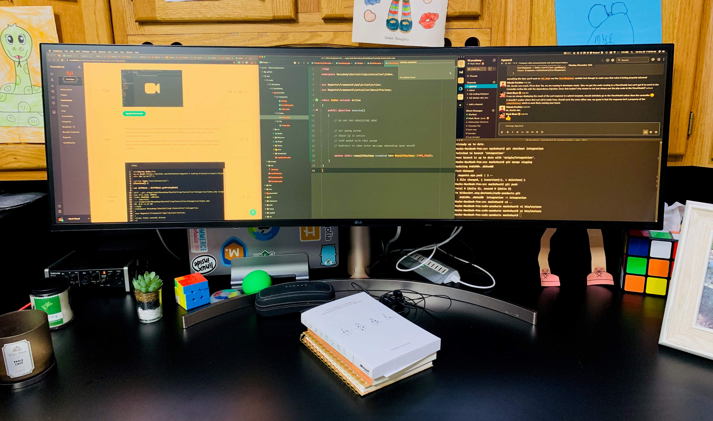

After using a Samsung screen for many years after my Chimei, the monitor wouldn't persistently power on and stay on so it was time for a new monitor. I always wanted the 38" ultrawide LG, but seeing it in person, it actually wasn't big enough for me. I've always suffered eye strain issues and the higher resolution meant I could see even less, even on a 38" screen. However, as soon as I saw the <a href="https://amzn.to/2EZViNR" target="_blank">LG 49" 49WL95C Ultrawide Monitor</a>, I knew I just had to have it. I'm not sure how anyone could say anything bad about this monitor. Having three windows open at a time for daily programming, and having the extra real estate while recording high DPI screencasts is absolutely awesome.

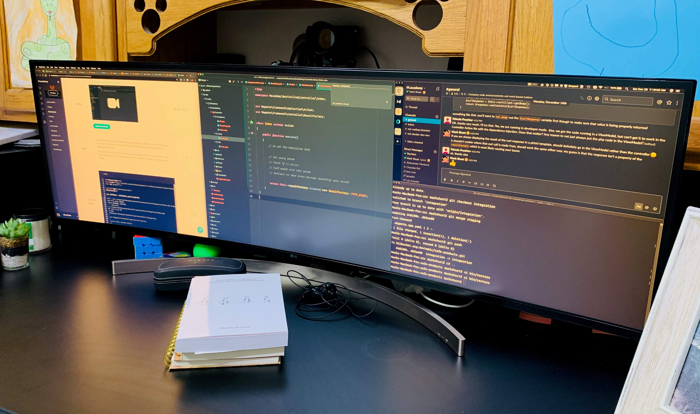

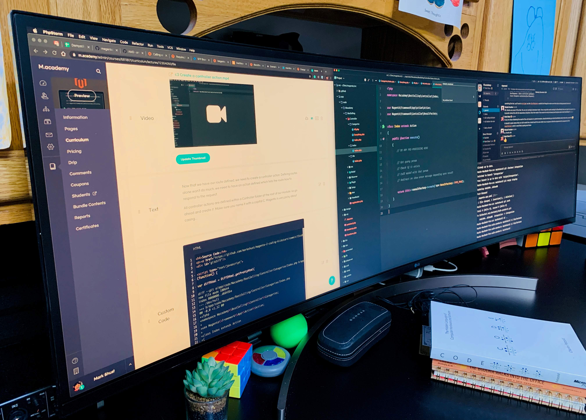

I tried to take some photos to show the actual size of this monitor. It looks big in photos, but when you see it in person, it's that much bigger and more impressive. Hesitating? Don't 🤘. The stand is pretty great, but the monitor wobbles a bit if you type really hard like I do - it's probably too wide for the stand. That said, the stand is very heavy and has a lot of levels of adjustment to set it at the perfect height and angle.

# Audio & Visual

While not ergomic, I thought I'd throw my lighting and audio setups into this post. I got heavily into screencasting and vlogging the last year, and needed my A/V equipment to also align with my ergonomic setup. This way, I can record either sitting down or standing up. If you are a fully remote worker such as myself, having a high-end webcam will make you appear more professional and lighting will take your video to a new level. I'm not in meetings much anymore, but if you are, being able to stand during meetings and still have your audio visual setup ideal keeps your look consistent.

## Mic

The best way to have great video? Have great audio. Your audio is way more important than video, so if you need to choose, start with the sound first.

I was lucky enough to be able to record screencasts for <a href="https://egghead.io/s/1rhsf" target="_blank">Egghead.io</a>, and their unbelievable team sent me an entire audio setup when I first started. I am really clueless when it comes to audio, but you just need to be sure to get a reliable mic and a way for you to connect it to your computer.

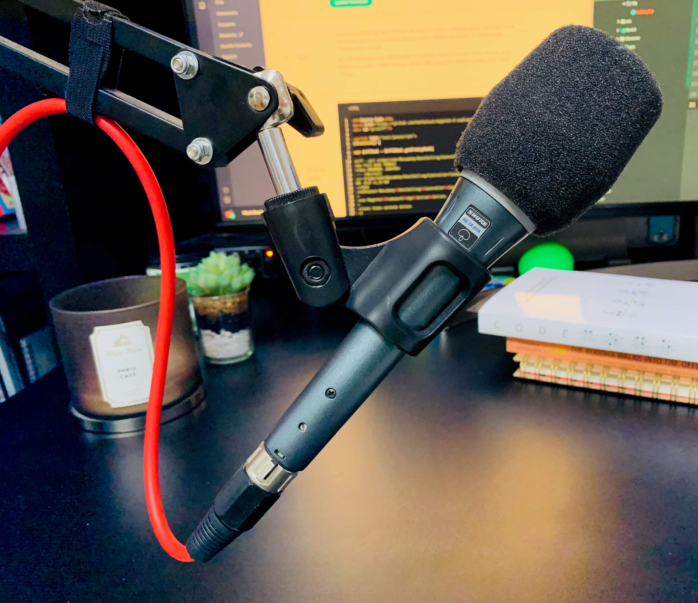

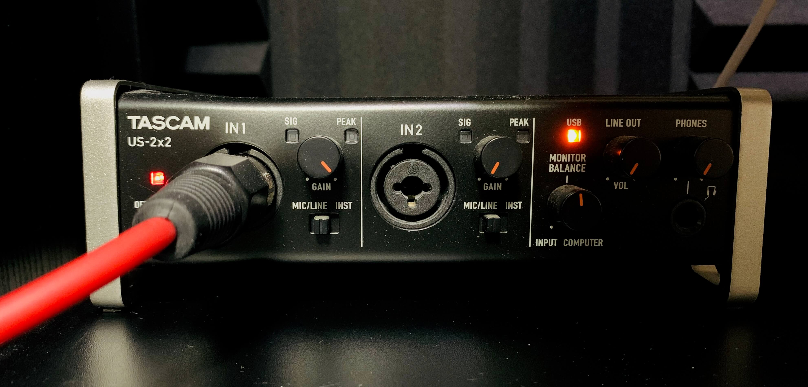

The mic I have is a <a href="https://amzn.to/2Qv25nI" target="_blank">Shure BETA 87A Supercardioid Condensor Microphone</a>, and the USB converter is the <a href="https://amzn.to/2tdEbpa" target="_blank">Tascam 2x2</a>. Any <a href="https://amzn.to/2rEsWFK" target="_blank">standard XLR mic cable</a> will connect the mic to the converter, and that just plugs into a USB port. Turn the gain up and you are done.

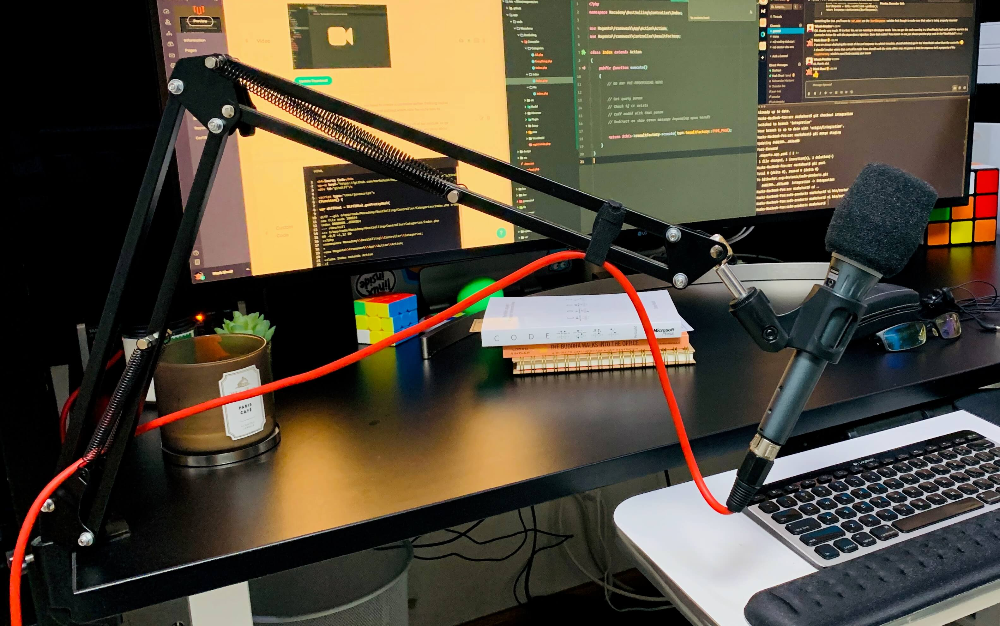

I'd recommend to get an XLR cable at least 4 feet long so you have some room to work with, and I mounted the mic to my sit/stand desk with the <a href="https://amzn.to/351kZI7" target="_blank">NEEWER Adjustable Scissor Arm Stand</a>. The stand is "ok" quality, but does it's task, and when things are all tightened up it works quite well. When I'm not recording or in meetings, it's easy to push it out of the way and ignore.

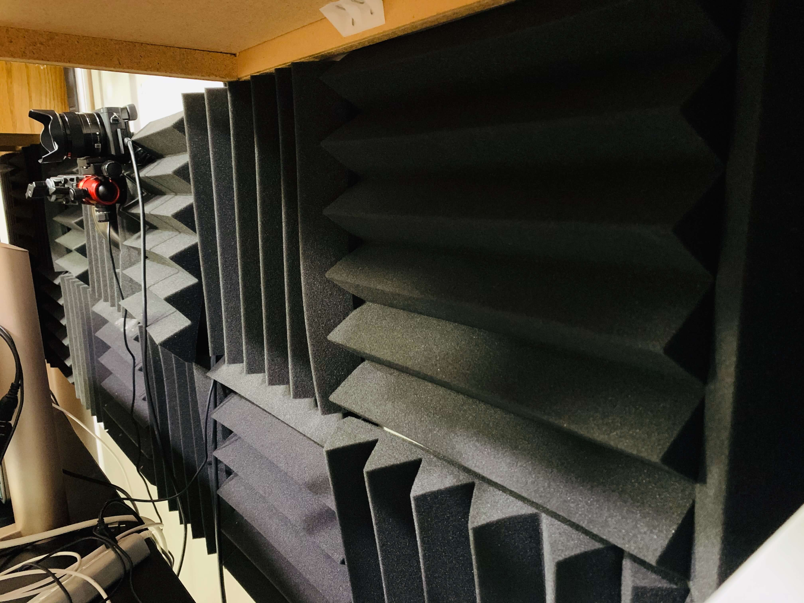

Some <a href="https://amzn.to/2F4KihS" target="_blank">acoustic noise panels</a> also help deaden echos in your room. Don't expect them to block noise, but rather make the noise coming out of your mouth a bit clearer. I'll probably add a few more to the ceiling.

## Camera

After you have your sound dialed in, the camera is your next step. I used the <a href="https://amzn.to/366Q6TZ" target="_blank">Logitech HD Pro Webcam C920</a> for a couple years, but it's still a webcam. The only way to get a truly better video during live streaming or recording is to use a digital SLR camera as a webcam.

The first step is to get the <a href="https://amzn.to/2MzLxK8" target="_blank">Elgato Cam Link 4K</a>. There are other options, but I settled on the Elgato because of cost and functionality. I've had zero issues live streaming at 1080, however it doesn't seem to stream at 4k on a Mac (not really an issue at the moment, because no one is live streaming 4k).

You'll need to have a digital SLR capable of delivering a video feed with "clean HDMI out". This means it can display video without all of those artifacts such as aperture, zoom, etc. displaying on the screen. I already had an old <a href="https://amzn.to/2SuZtZX" target="_blank">Sony Alpha A57</a> I thought I could use, however the video only recorded 720 which is absolutely awful nowadays, and it didn't have clean HDMI output, so using it for live streams was a no-op. I love that camera, but it showed its age.

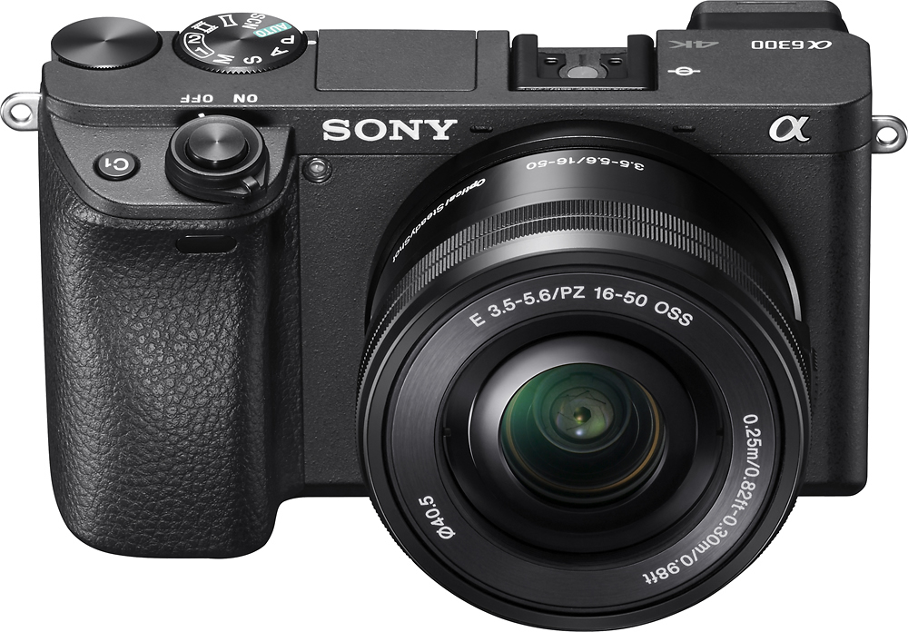

I conducted a massive amount of research before purchasing another camera. I wanted one that I could trust wouldn't be obsolete anytime soon (so it had to be 4k), it couldn't break the bank as I just dropped a ton of dough on other stuff, and I needed to be able to purchase extra lenses fairly affordably. I ultimately decided on the <a href="https://amzn.to/2taaCEK" target="_blank">Sony Alpha A6300</a> because I wanted to stick with the Sony family, and it was very easy to use.

The lens that usually comes with the camera is a 50mm, which is a no-op for me. I wanted to mount the camera behind my computer monitor, and have limited space in my office. After a lot of research I went with a <a href="https://amzn.to/39h0kn3" target="_blank">Sony SEL35F18 35mm f/1.8 Prime Lens</a>. Mounted about a yard in front of my face, it would display a great focal length and also blur out the background as much as I want.

I was lucky enough to score the camera and lense together for around $600 on Facebook Marketplace. I would check Marketplace or eBay for a used camera and lens, as they typically don't really ever wear out!

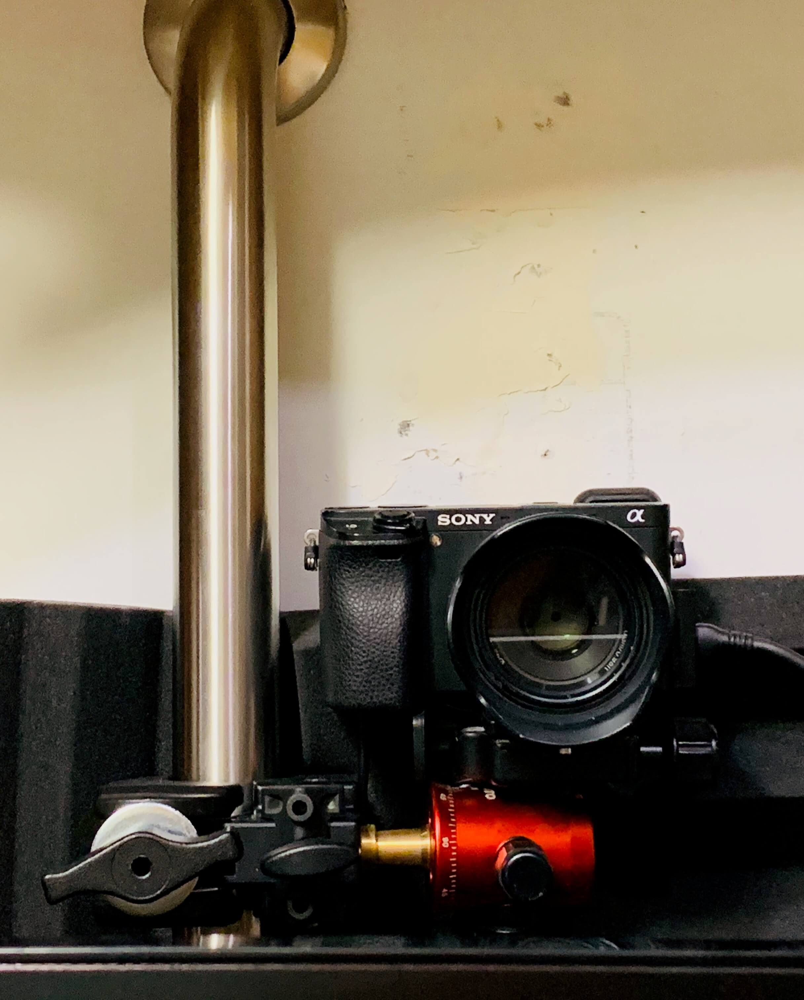

The mount is where things got confusing for me. Luckily my brother is a professional cinematographer, and he was able to help me with mounting hardware. The first piece you want is an <a href="https://amzn.to/2rEvsMc" target="_blank">Manfrotto Avenger Super Clamp</a>, so you can clamp the camera down hard and it won't vibrate. You'll need a ballhead from a nice tripod to allow you to position the camera at any angle. I went with the <a href="https://amzn.to/2SFoHVD" target="_blank">MeFOTO Tripod</a> under the advice of my brother, apparently the MeFOTO's are of much better quality than other tripods and adjust really well. Once you have the tripod, you're able to unscrew just the ballhead from it and mount it to the Super Clamp.

You'll also need the <a href="https://amzn.to/2EXiV9L" target="_blank">1/4"-20 Male Thread Screw Adapter Hexagonal Stud</a> to connect the Super Clamp to the tripod ballhead. You'll want to get an <a href="https://amzn.to/2tbADU2" target="_blank">Arca Swiss Quick Release Plate</a> so you can easily connect it to the ballhead, and also easily attach and remove the camera for when you need it off the mount. Even if you aren't live streaming and are just recording video, you'll also want to get an <a href="https://amzn.to/2tZEdkN" target="_blank">AC Power Supply Adapter Kit</a> so you don't need to constantly charge your camera's battery, and it can stay always on.

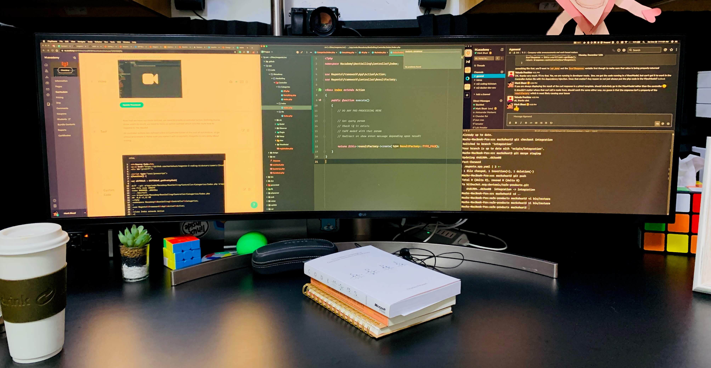
*The camera active when sitting*

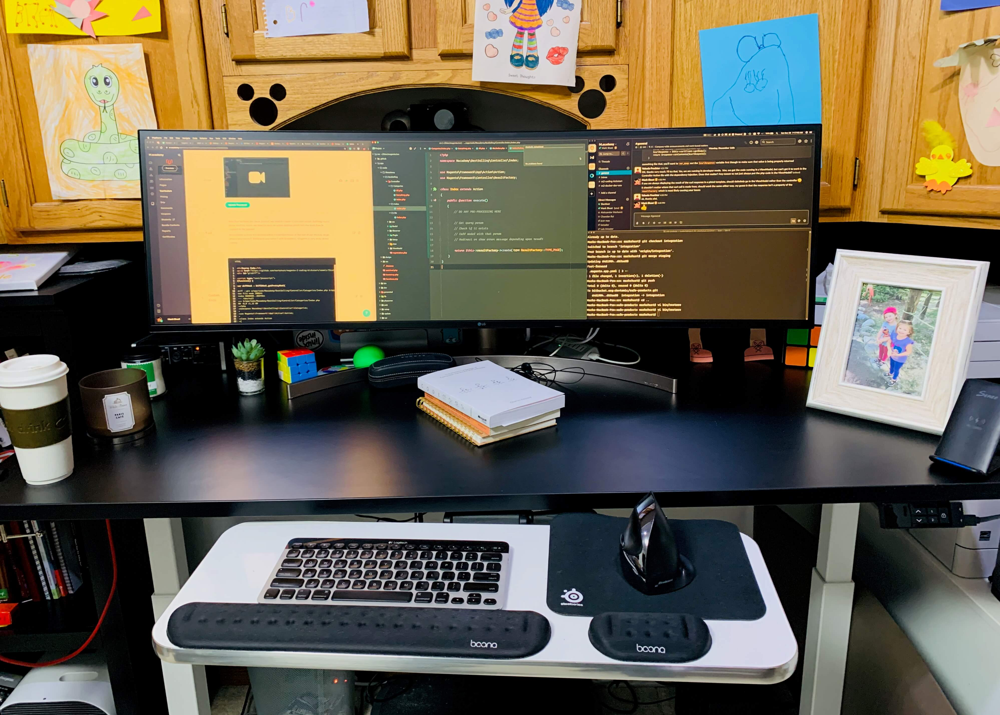
*The camera active while standing after adjusting*

The entire clamping setup should now be all set, but you'll need to mount it somewhere. I wanted very tight clearance against my wall, so I got a <a href="https://amzn.to/2ME2l2N" target="_blank">16" x 1.15" shower grab bar</a> to mount everything up to. It's thick, solid, & heavy, so the camera will never vibrate. I avoided mounting the camera to my standing desk, because it would vibrate whenever I typed or even touched my desk. Be sure to mount the camera to somewhere solid so it won't move. The 16" bar will also allow me to mount the camera lower or higher for sitting or standing, and the ballhead allows me to exactly adjust the angle of the camera depending on where I want to record from.

## Lighting

With a great camera in place, you'll look super professional, right? Well, not really. You can actually get a much lesser quality camera and have amazing results if your lighting is correct. It's all. about. the. lighting.

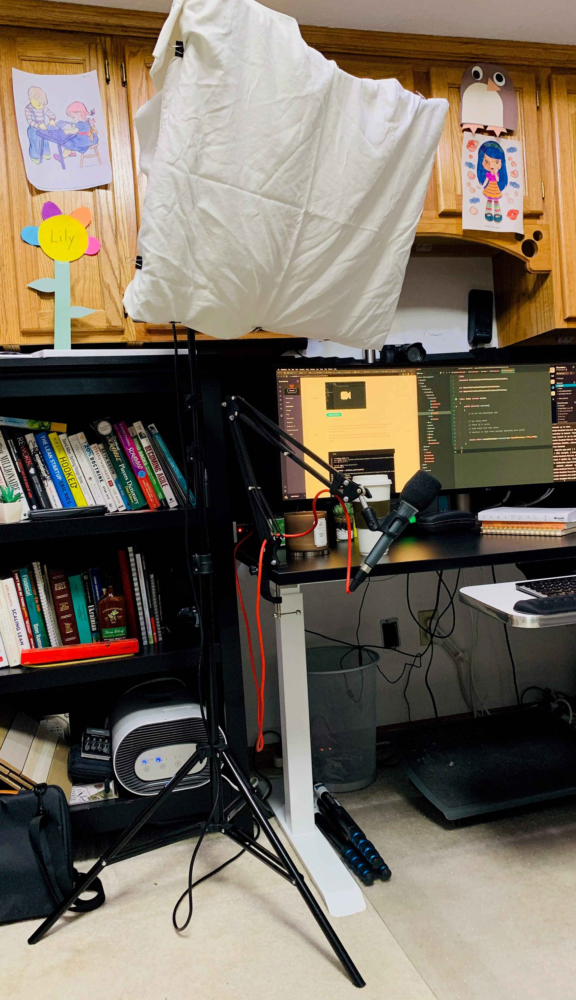

I didn't want to spend too much more money, so I went with a <a href="https://amzn.to/39kSEQI" target="_blank">Fovitec Softbox</a> and wow, what a light this is. I also got <a href="https://amzn.to/2rzDJkq" target="_blank">some sandbags</a> to keep the base sturdy and ensure it doesn't fall over, but haven't got a chance to set those up yet. The light consists and comes with five 45w flourescent bulbs which put out a ton of light. When recording, I only turn two or four of the five bulbs on (depending on what I'm doing), and it's plenty bright.

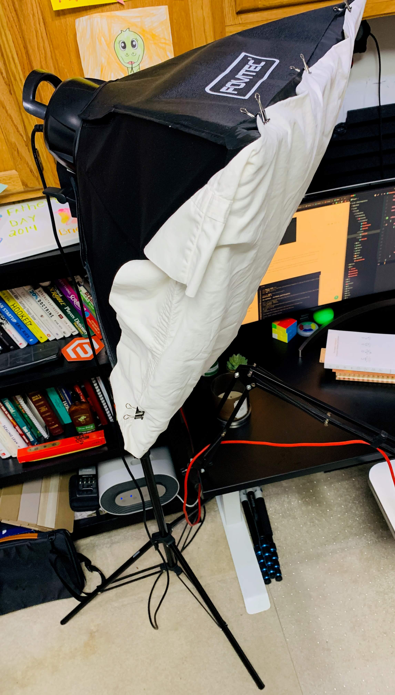

The stand it comes with is great, and allows me to easily pivot and move the light around for when I raise and lower the desk. You'll want to position this light as close as you can to your face without getting a glare or covering your screen. For me, the built-in diffuser wasn't sufficient, so I found an old pillowcase and used some binder clips to hold it in place. I really love the look of this, as the slightly off white of the pillowcase added some warmth to the video.

Here are some before and afters of the camera video, and how things progressed from the old camera and lighting, the new camera without lighting, and then the final setup getting dialed in.

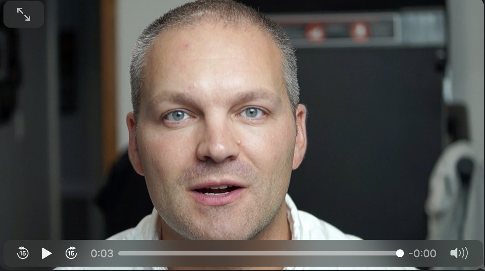
*Sony Alpha A47 with SAL35F18*

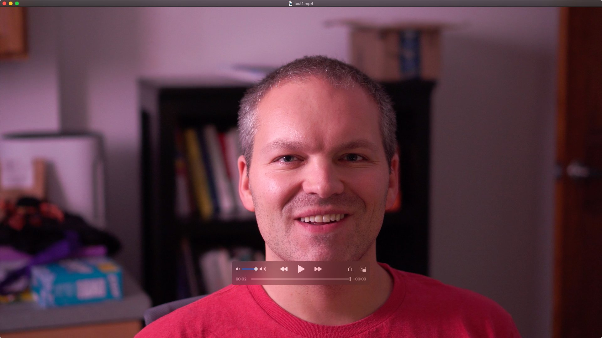
*Sony Alpha A6300 with SEL35F18, no lighting*

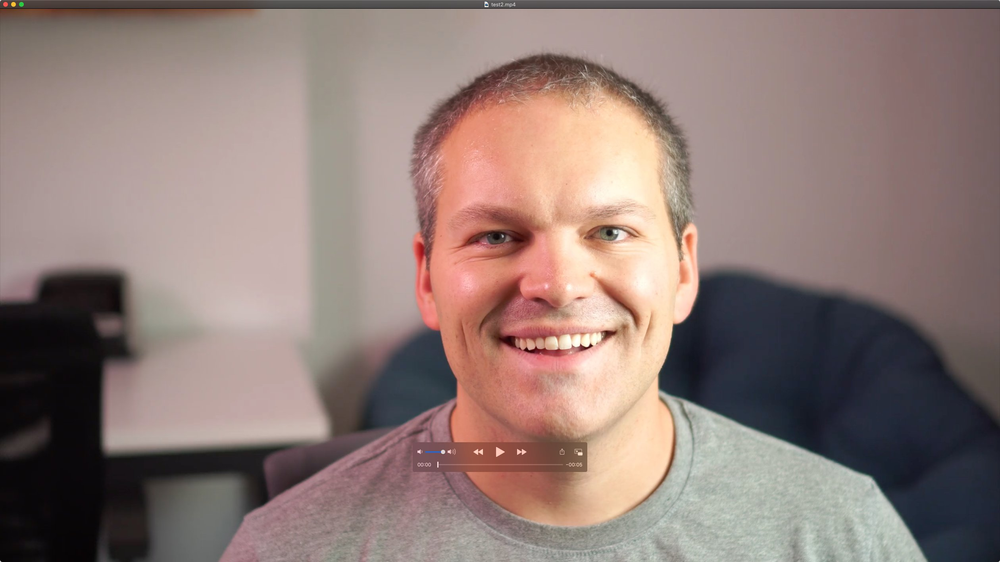
*Sony Alpha A6300 with SEL35F18, Fovitec with external light coming in*

*Sony Alpha A6300 with SEL35F18, Fovitec with external light blocked*

*FINAL: Sony Alpha A6300 with SEL35F18, Fovitec brighter with background accent light*

I placed a <a href="https://amzn.to/2Zvqaiw" target="_blank">Himalayan Salt Lamp</a> in the background to frame out the dark side of my face. I also messed around with "hair lights" (literally lights that aim at your hair), but didn't like the feel of them or the harshness of the bright light as I recorded.

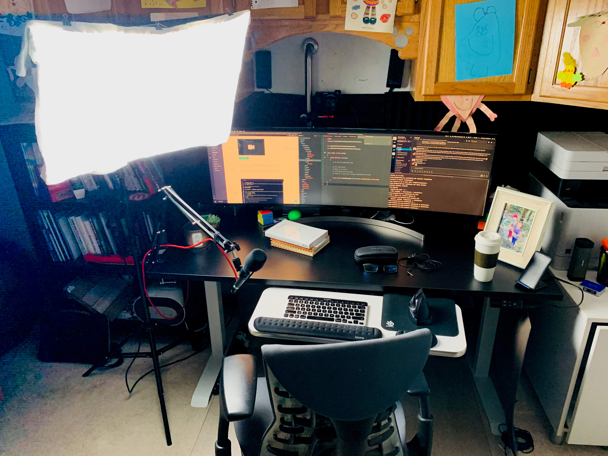

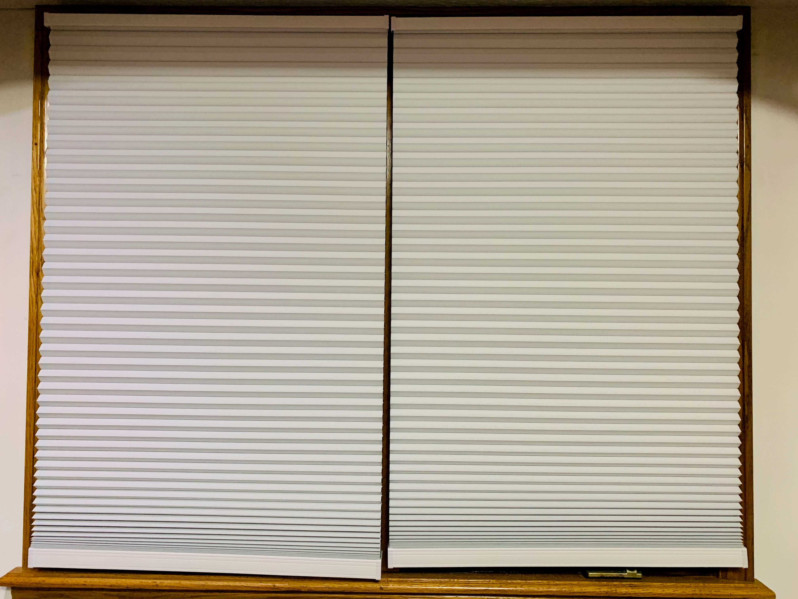

Note that the softbox light should be the only light on in your room. All of the rest of the lights in my office are killed when I record, and I also got <a href="https://amzn.to/36557pj" target="_blank">Blackout Cellular Shades</a> to prevent any light from seeping in during the day. You'll want to control as much of the light in the room as possible, so things are consistent and not dependent upon the weather outside or time of day.

## Extra Credit

I also think it's worth mentioning to get some sort of UV blocking computer glasses so you can work all day without eye strain. My favorites are the <a href="https://amzn.to/2MBjF8F" target="_blank">Gunnar Phenom</a>, because I have a big fat head and these are the widest Gunnars.

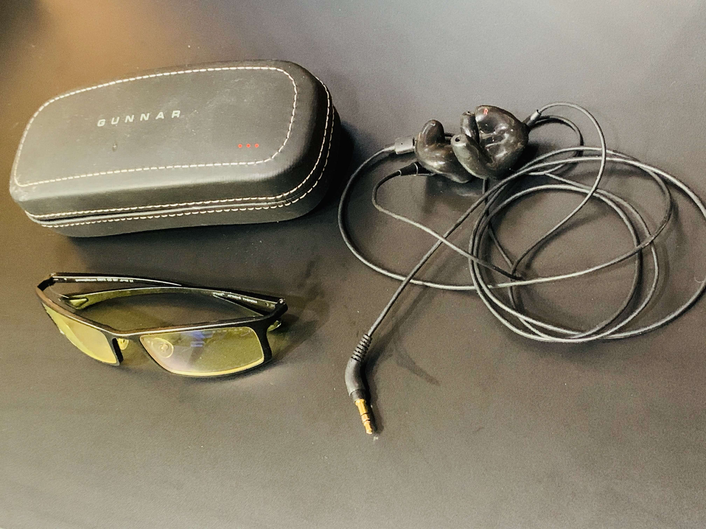

Did I mention I have twin 5 year old girls at home? You'll need some noise isolating earphones (not canceling, but isolating). I absolutely swear by my <a href="https://amzn.to/2MykTS0" target="_blank">Etymotic MK5 Noise Isolating In-Ear Earphones</a>. They are pretty cheap and have absolutely great sound. If you are ok wearing ear plugs all day, I'd recommend having a handy collection of <a href="https://amzn.to/2Zv5ze4" target="_blank">Foam Replacement Eartips</a>. Personally, after an hour or so they tend to hurt my ears a bit if I wear them day in and day out. Because of this, I would recommend to <a href="https://www.etymotic.com/consumer/custom-fit" target="_blank">upgrade to custom fit earmolds</a>. You make an appointment at a local center, they squirt some cooling gel into your ear that feels really weird, and within a couple weeks use that ear impression to create custom molds for your ears. It's a few hundred bucks but you can wear them 8+ hours a day in complete comfort. I'd say they block about 70% of the sound that the foam plugs do, which is plenty if you are listening to music. If you need 100% sound isolation, stick with the foam tips.

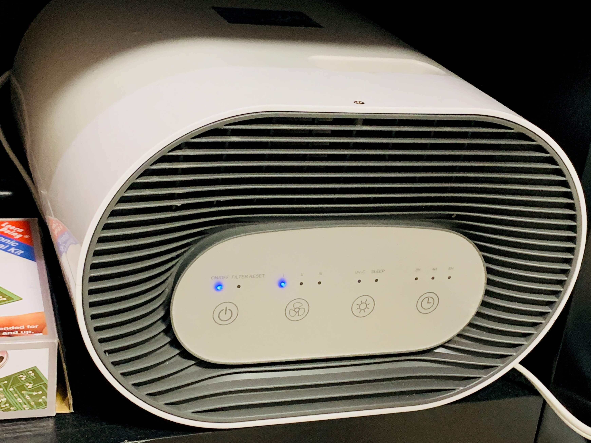

I'd also recommend putting some sort of HEPA air purifier in your office. You're in your office all day, so you want to be sure you are breathing in clean air. The choice for me was the <a href="https://amzn.to/37fStUF" target="_blank">PureZone Air Purifier</a>, which is a true HEPA filter which helps if you have allergies or pets. It's whisper quiet on the lowest setting, and doubles as a nice white noise maker on the high setting.

# Conclusion

Well, that's about it. Anyone who thinks video recording or creating screencast lessons is easy will have a tough road ahead. There are a lot of expenses involved, especially if you want to do things full time, be comfortable, and not have bad ergonomics kill you. I struggled mightly along the way, and wanted to create a post to inform others of my setup and hopefully help them avoid the headaches.

I'm an avid Amazon-er, and I'm sure you are too. I prefer to purchase just about everything from Amazon, so I can be assured I will recieve the items and within a couple days. The above links refer to my affiliate account with Amazon, so if this article helped you at all I'd appreciate it if you purchasing the items using the above links. Just be sure to never buy Amazon-branded items, as it kills the businesses of small & medium sized merchants. Always pay extra for non-Amazon-branded items wherever possible on items which are not a commodity so you can do your part to help keep small businesses in business.
