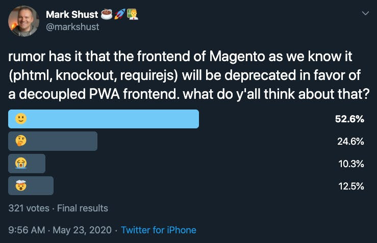
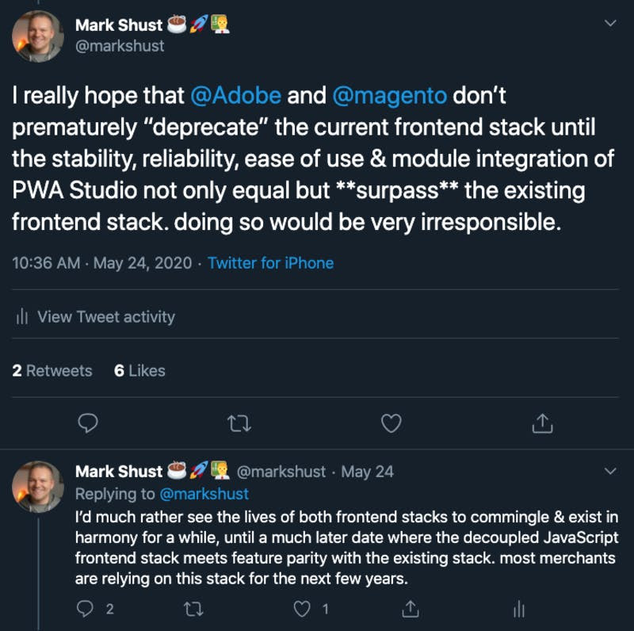
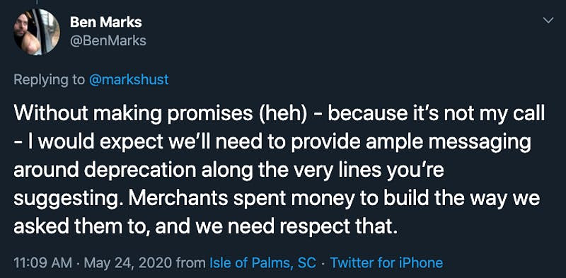

I've been hearing that PWA's ([progressive web apps](https://en.wikipedia.org/wiki/Progressive_web_application)) are going to be "the future of the web" for quite a while now. The beating of the drum has been going on for a few years now, each year being "the year" that PWA's will win out.

While PWA usage has been slowly increasing since its inception, it's been been a far cry from the death knell of "classic" web apps which we have been promised. The fact is that paradigm shifts in computing usually take many years, if not decades to catch on, and this is no exception.

A while back, Magento Inc. mentioned that with the release of their [PWA Studio](https://magento.github.io/pwa-studio/) that the "classic" frontend would be deprecated. Unfortunately I do not have the source, but I do know for a fact this was mentioned by members of their staff. This struck me as odd, because how in the world could you deprecate solid, stable frontend tech which has full Magento Marketplace integration, for a new technology that is completely unproven, with no integrations, and the maturity of alpha software?

A few days back [I ran a poll on Twitter](https://twitter.com/markshust/status/1264193378960519169) asking what everyone thought about those rumblings, and here were the results:

The results were about what I expected them to be. Twitter wouldn't let me vote in my own poll, but if I had to vote, I'd be between the 🤔 and 😭 emojis.

I followed up this poll with a [thread of why I think it would be a horrible idea for Adobe/Magento to do this](https://twitter.com/markshust/status/1264559797313122305), and what the ideal approach would look like, capping it off with:

The poll was without a doubt at least 80% bias towards developers, as that's who follows me on Twitter. The [Pareto principle](https://en.wikipedia.org/wiki/Pareto_principle) applies here, as 77% of voters were either 🙂 or 🤔. However, if you ask a merchant for their feedback, 80% of them would almost assuredly vote for either the 😭 or 🤯 emoji.

Think about it -- if you just fairly recently spent $100,000 building a brand new eCommerce storefront on Magento 2, then perhaps another $50,000+ every year maintaining it afterward, continuing to make it polished and stable, would you be willing to push it all aside to rebuild it from the ground up for not much increase in business value? There is a really easy business answer to this: **NO**.

This is most likely the reason a "decoupled PWA" frontend has not yet caught on. Not only is PWA Studio currently underdeveloped and unstable, but as a merchant you are really living on a tightrope being an early adopter. Instead of dropping hundreds of thousands of dollars to build your storefront, the lifeblood of your company, on a framework that comes with a tremendous amount of risk and unknowns... why not just choose the path of least resistance with the "classic" frontend, which will most likely be around for quite a while longer? It's unsexy, but it's the correct choice.

I know there will be those who recommend [Vue Storefront](https://www.vuestorefront.io/). While this may currently be a great option for some merchants, it has two major downfalls: zero compatibility with the Magento Marketplace, and requires a dedicated staff of JavaScript developers on your team. I've noticed some merchants starting a Vue Storefront project without a group of experienced JavaScript developers on their team, and that is just a disaster waiting to happen.

Thankfully, [Ben Marks (Adobe's Magento Evangelist) is in agreement](https://twitter.com/BenMarks/status/1264574294451015680) with a longer deprecation cycle:

I do think there will be a time & place when PWA Studio will overtake the existing frontend, as tech tends to majorly roll-over every 5-10 years. However, I think it could still be quite a while longer until this happens within the Magento ecosystem.

I'm still **strongly** recommending new Magento projects be built on the "classic" frontend stack of PHTML, RequireJS, & KnockoutJS. While it may not be the most up-to-date tech stack around, it's solid, stable, and proven, and has the entire Magento Marketplace at its disposal. PWA's will eventually have their time and place to shine in the Magento world, but today isn't their day, and tomorrow isn't looking so good either.

Some food for thought: did you know that you can make the existing "classic" frontend into a PWA? More on that later.
