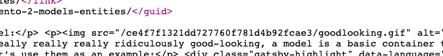

I've been using Gatsby for my blog for some time now. It's been great, especially when you follow [the easy way to add & customize an RSS feed](https://www.gatsbyjs.org/docs/adding-an-rss-feed/#customizing-the-rss-feed-plugin) with the `gatsby-plugin-feed` plugin.

I use the RSS feed to trigger an automatic email newsletter being sent by ConvertKit. Things are configured so the entire blog post content is sent in the email, so subscribers don't even need to visit my website.

Overall, it works pretty great, however, I had the problem with images not showing within emails. This is because the RSS feed references content in the same way the Gatsby frontend renders it, with relative paths:



This works fine for the frontend of the site in both develop and production modes because the current site URL is used as the base path when the request for an image occurs. However, when reading within an email client, it doesn't render the image since the base path either doesn't exist or falls back to `http://localhost`.

To resolve this, we need to update the RSS feed serializer within the `gatsby-config.js` file. The example from the `gatsby-plugin-feed` plugin presents this as the base value to work with when customizing RSS feeds:

```js
...
feeds: [
  {
    serialize: ({ query: { site, allMarkdownRemark } }) => {
      return allMarkdownRemark.edges.map(edge => {
        return Object.assign({}, edge.node.frontmatter, {
          description: edge.node.excerpt,
          date: edge.node.frontmatter.date,
          url: site.siteMetadata.siteUrl + edge.node.fields.slug,
          // highlight-next-line
          custom_elements: [{ "content:encoded": edge.node.html }],
        })
      })
    },
...
```

The value responsible for rendering HTML content is added by the `custom_elements` object property with the `"content:encoded"` property, which gets the value from `edge.node.html`.

We'll need to look through this `edge.node.html` property, search for references of a relative path, and replace them with absolute paths. We can use the `siteUrl` property from the `site.siteMetadata` object as the absolute path for our images. This makes the above lines become:

```js
...
feeds: [
  {
    serialize: ({ query: { site, allMarkdownRemark } }) => {
      return allMarkdownRemark.edges.map(edge => {
        return Object.assign({}, edge.node.frontmatter, {
          description: edge.node.excerpt,
          date: edge.node.frontmatter.date,
          url: site.siteMetadata.siteUrl + edge.node.fields.slug,
          // highlight-start
          custom_elements: [
            {
              "content:encoded": edge.node.html.replace(
                '<img src="/',
                `<img src="${site.siteMetadata.siteUrl}/`
              ),
            },
          ],
          //highlight-end
        })
      })
    },
...
```

Luckily this is a really easy solution to implement, and this post should now properly email to my subscribers with the images rendered inline within their email client.
