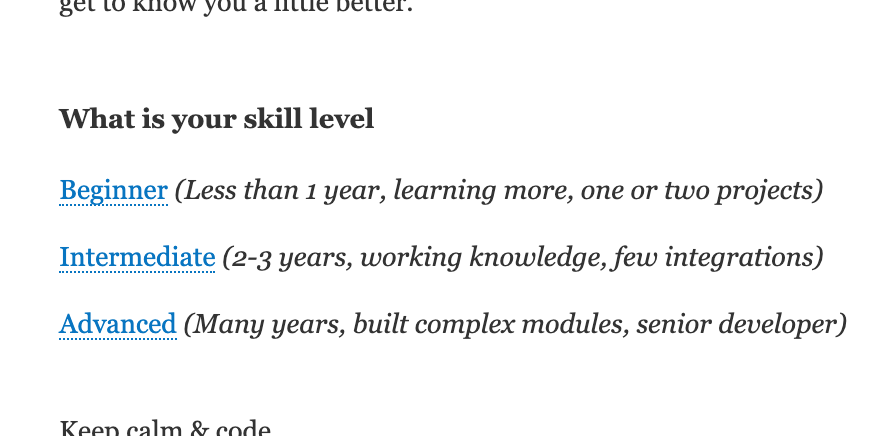
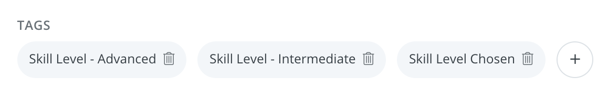
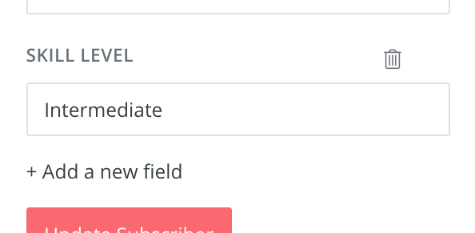
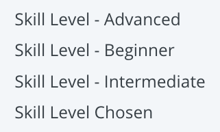
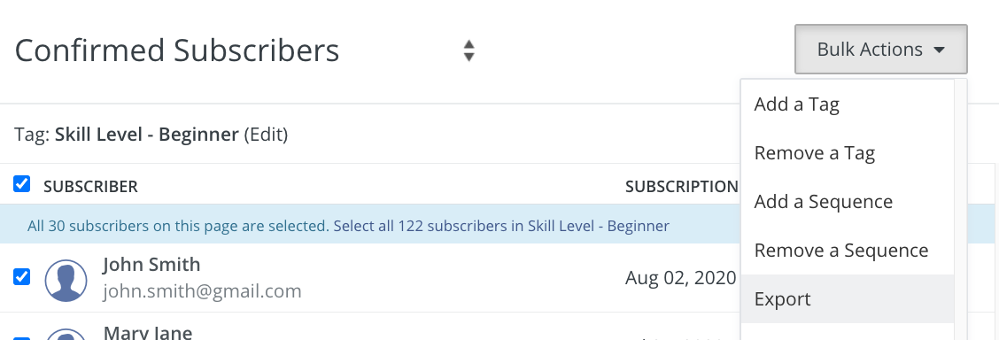
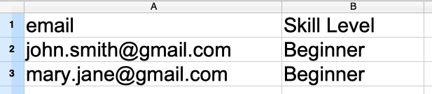
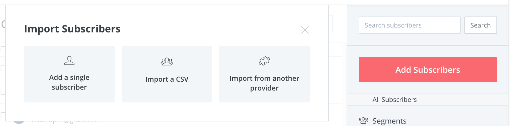
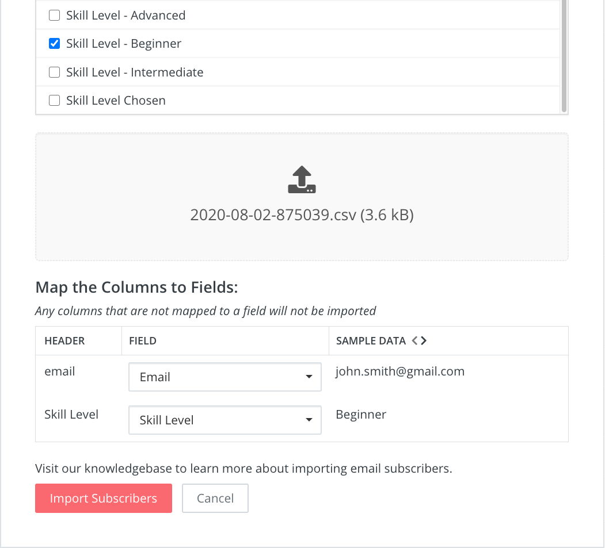
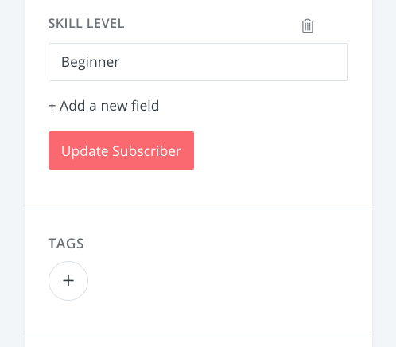

I use [ConvertKit](https://convertkit.com?lmref=H-B-iA) to manage my newsletter email subscriptions. Part of using the service is ConvertKit's "Sequence" functionality for my ["tips & tricks"](https://m.academy/magento-2-tips-tricks) emails. Every few days, I send out an email to subscribers about a new programming tip.

In order to make sure my subscribers receive content that is appropriate for them, I ask them what their skill level is during a welcome email. When they click the appropriate link in the email, a combination of tags & automated triggers are executed to add the appropriate tag to the subscriber's record.

The problem with this method in this situation is that it's possible for a subscriber to click the link twice, leading to data corruption by applying more than one tag to their record. When this happens, it's not possible to determine which skill level the subscriber actually wishes to be classified under.

Usually tags are a great option, but in this case a great alternative approach is to use custom fields. A custom field is a simple key value store containing just a text field value. This fixes the data corruption issue because only one key value can exist for each subscriber.

While this works great as a proper fix to the problem, you'll face an issue if you have existing subscribers that you need to convert. There is nothing built into ConvertKit that allows you to mass-assign values to custom fields. I have thousands of subscribers, so an automated process is required. The method you must use to convert the data is the "import" functionality to mass-assign these custom field values.

## Step 1: Create a new custom field

When navigating to a subscriber's record, click the "Add a new field" link to add a custom field. My tags were "Skill Level - Beginner", "Skill Level - Intermediate", and "Skill Level - Advanced".

You'll want to take the base value of these tags and create a custom field, in my case "Skill Level".

## Step 2: Export subscribers

The next step is to filter subscribers for a specific tag to convert. Click the first tag you wish to convert. Then, select all of the subscribers, and select Export from the Bulk Actions dropdown menu. I stated with the "Skill Level - Beginner" tag first.

## Step 3: Update the CSV

The CSV will then be emailed to you. Open up the file in your favorite spreadsheet editor. Delete all of the columns except "email" and your custom field ("Skill Level" in my case). Then, enter the related value for the custom field that you wish to update for these records.

For example, I exported records containing the "Skill Level - Beginner" tag. Next, I'll then set the "Skill Level" custom field to the value of "Beginner" for all of these records.

## Step 4: Import new data

Click the big Add Subscribers button, then Import a CSV.

You'll then need to choose a tag to assign to this import. In this case, I just selected the tag that was just exported, "Skill Level - Beginner".

Next, drag & drop your updated CSV file into the box and map the columns to fields. I'll map email to Email, and Skill Level to Skill Level. Next, click Import Subscribers.

ConvertKit will notice that records for these email addresses already exist, and only update the "Skill Level" custom field. After the records have finished import processing, you'll then see the records with the updated data.

Repeat the above steps for each record & field you wish to migrate.

## Step 5: Clean up old data

After all of the records have been migrated, you'll want to update any existing sequence rules & triggers to instead use your new custom field. When that is complete, you are free to remove the old tags to avoid redundant data.

In my case, I can now remove the "Skill Level - Beginner", "Skill Level - Intermediate", and "Skill Level - Advanced" tags. I can also remove the "Skill Level Chosen" tag because I can easily determine if the skill level has been set by checking if the "Skill Level" custom field has a value.

> Want to send out your own emails? Signup for [ConvertKit's free plan](https://app.convertkit.com/users/signup?plan=free-limited&lmref=H-B-iA) to get started. I've been using their service for over a year now and it's been 👍.

Have another neat trick for ConvertKit? Let me know by tweeting me [@MarkShust](https://twitter.com/MarkShust). I'm always interested in any new ideas & hacks that you may come up with!
