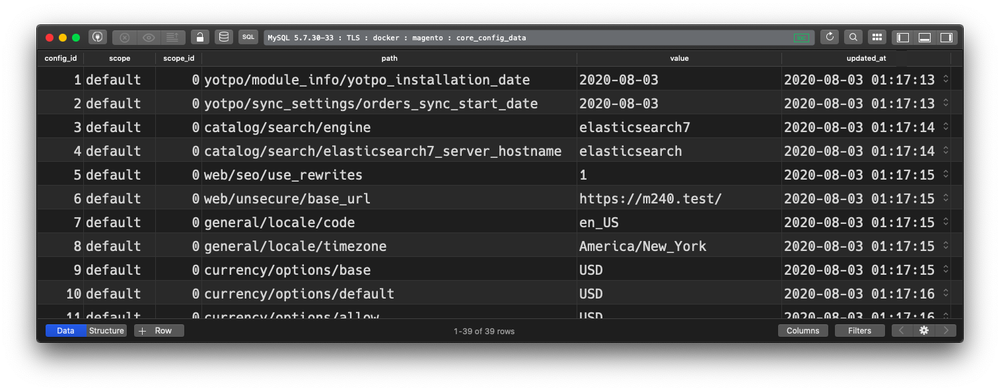
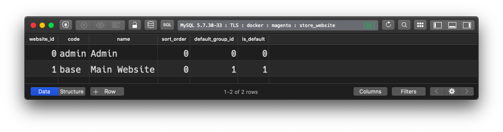
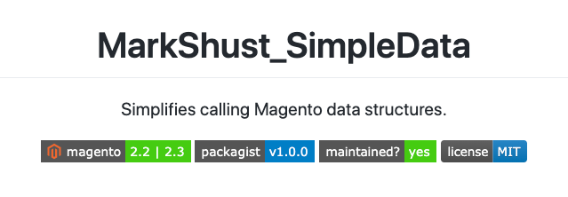
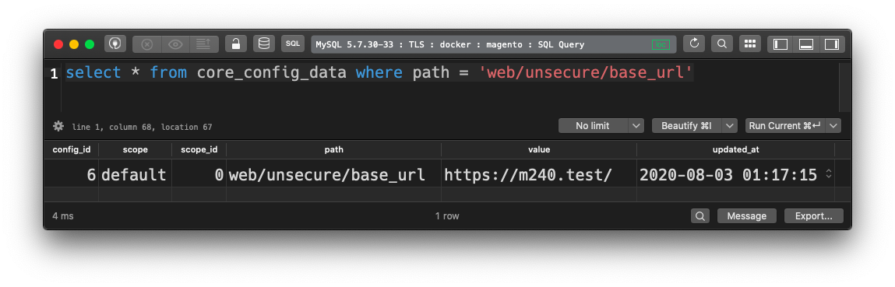

The Magento configuration layer appears to be simple: create a config variable, then assign it a value. Easy-peasy, right? Not so fast. Under the hood, it's actually fairly complex. Let's touch base on the different methods you can create, modify & manage config values. Each has it's drawbacks & benefits, and when to use each depends on your use-case.

## Create configuration with XML

In order to assign values to configuration variables, they must first be created with XML. Magento looks for a `config.xml` file within each module's `etc` folder. It parses through all of these files, and builds one giant XML tree from them. It then processes the tree and uses it as the base configuration for your storefront.

The format of the `etc/config.xml` file is as follows:

```xml
<?xml version="1.0"?>
<config xmlns:xsi="http://www.w3.org/2001/XMLSchema-instance"
       xsi:noNamespaceSchemaLocation="urn:magento:module:Magento_Store:etc/config.xsd">
    <!-- This is the "config type" and is "default", "stores" or "websites" -->
    <default>
        <!-- Every config reference is just a key:value store -->
        <key>value</key>
        <!-- An optional path can and is usually set by wrapping nodes -->
        <some>
            <arbitrary>
                <!-- This config key will have the path some/arbitrary/key -->
                <key>value</key>
            </arbitrary>
        </some>
    </default>
    <!--
    If the config type is "stores" or "websites", the corresponding child node
    is used to determine the scope of the configuration value
    -->
    <websites>
        <!-- The config here will only apply to the "base" website -->
        <base>
            <key>value</key>
        </admin>
    </websites>
</config>
```

> View & download this snippet online at [Magento 2 Snippets: Create Configuration with XML](https://mdotacademy.snippets.cc/collection/magento-2/create-configuration-xml)

Note that config values apply to a scope ("stores" or "websites") or to all scopes ("default"). The "default" node is the most common usage used here, as values set here for configurations just define the default values. These values are then usually overridden using one of the below methods.

The path to the configuration is set by the nesting of nodes. This allows you to organize configuration keys, which will definitely be needed due to the sheer amount of configuration objects that exist, even in an out-of-the-box installation of Magento.

You'll need to use this method to create configuration keys.

## Modify config with database

After the config is set with XML, it can then be overridden with a database value. The `core_config_data` database table is used to store and retrieve config values.



Within this table are "scope", "scope_id", "path" and "value" columns, which are used to set configuration values. Numerous records can exist for each configuration path for the different available scopes.

> Note that the config XML uses a human-friendly reference (ex. "base"), while the database column uses an integer reference ("scope_id" column). The integer value can be found in the "store" or "store_website" database tables, for either the store or website, respectively.

For the above `website/base` example, we will reference the `store_website` database table and look for a row `WHERE code = 'base'`. This row references the website ID of `1`, which would be the value we can reference for our `scope_id`.



This method is useful to override changes already made to the database.

> Need a simple way to write code programmatically to do this? Check out the [MarkShust_SimpleData](https://github.com/markshust/magento2-module-simpledata) module, as I created it just for this scenario!
> 
> [](https://github.com/markshust/magento2-module-simpledata)

## Setting config values with environment variables

A little known fact not widely known by newer Magento developers is that the configuration can also be set with environment variables, or "env vars" for short. Env vars are set on the operating system or host machine level, which allows values to be dynamically changed at runtime. It is also useful if the value should be dependent upon the environment it's run within.

Let's use the "Unsecure Base URL" as an example, which is used by Magento to determine the value of the base URL. This value is defined within the config XML file at `vendor/magento/module-store/etc/config.xml`:

```xml
<config xmlns:xsi="http://www.w3.org/2001/XMLSchema-instance" xsi:noNamespaceSchemaLocation="urn:magento:module:Magento_Store:etc/config.xsd">
    <default>
        ...
        <web>
            ...
            <unsecure>
                <base_url>{{base_url}}</base_url>
            ...
```

The value for this URL is typically set when Magento is installed, and the value is stored in the database. If we query the `core_config_data` table for it's value translated to slashes, `web/unsecure/base_url`, we'll see the value of or storefront URL:



The value of our website here would typically be a production URL, such as `https://mywebsite.com/`. In staging environments however, this value will need to be different.

To override a value for a specific environment, we can set it with an environment variable. The format for an env var is all caps, with paths delimited by two underscores. For our base URL the path would be:

```CONFIG__DEFAULT__WEB__UNSECURE__BASE_URL```

Assuming the staging environment is on a subdomain of the base URL, you would set it to a value of something like:

```CONFIG__DEFAULT__WEB__UNSECURE__BASE_URL=https://staging.mywebsite.com/```

> If you wish, you can [learn a bit more about environment variables](https://en.wikipedia.org/wiki/Environment_variable).

This method is useful if you need a different configuration value set for each environment.

## Manage config values with config.php

The final way to manage configuration values is with the `config.php` file. While this file is generally known to control which modules are enabled or disabled on your site, you can also store values for specific scopes in this file so they are under version control, and they can be automatically applied to each environment when pulling down new code.

Let's say you wanted to modify the locale of your entire storefront. Rather than setting this value in the database which would require you to log in to each environment and set it manually, you can add this format to your `app/etc/config.php` file:

```php
<?php
return [
    'system' => [
        'default' => [
            'general' => [
                'locale' => [
                    'code' => 'en_US'
                ],
            ],
        ],
    ],
    'modules' => [
        'Magento_AdminAnalytics' => 1,
        'Magento_Store' => 1,
        'Magento_Directory' => 1,
        ...
```

You'd then commit and push the file changes upstream to your code repository. When pulling down code to another environment, you could apply the updates to this file by running:

```bash
bin/magento app:config:import
```

This method is useful when you wish to share config values between environments and want to track the history of these changes in version control, but don't need to have values changed for different environments. Note that this line should always be included in your scripts when deploying code.
